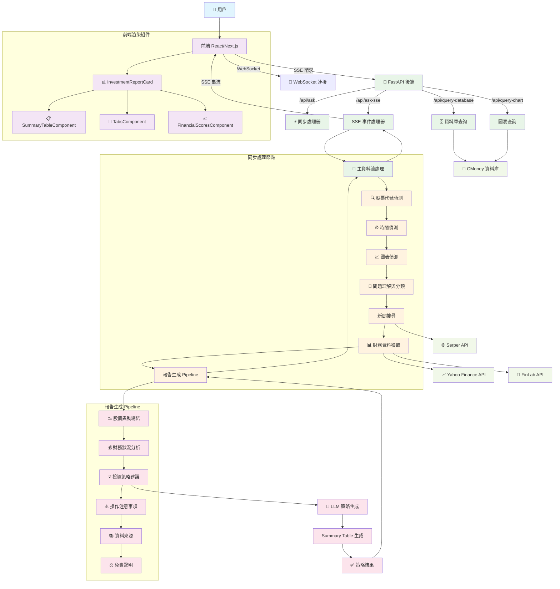
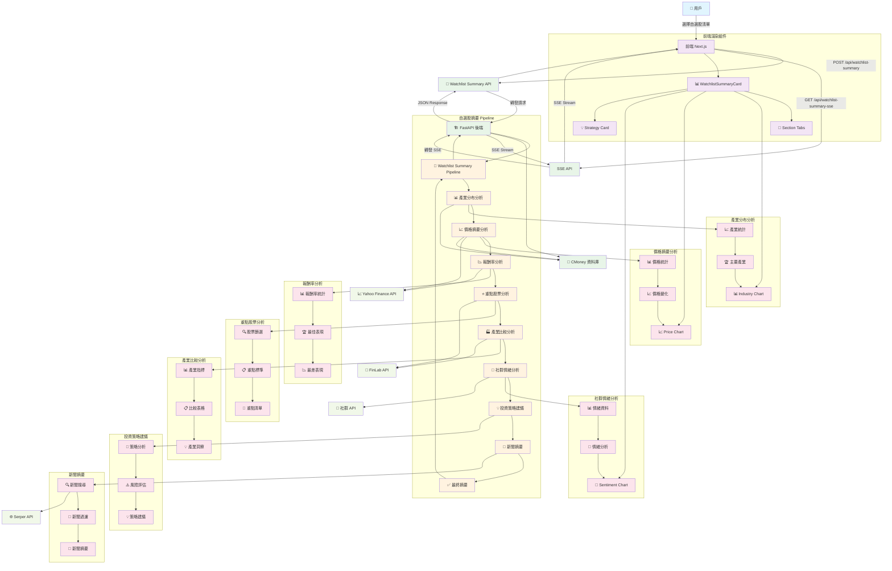

# 系統架構圖

## 自選股摘要流程圖

## 架構說明

* **前端 (Next.js)**：負責用戶互動、頁面渲染、API 請求。
* **後端 (FastAPI + LangGraph)**：負責問題理解、新聞搜尋、資料彙整、投資報告生成。
* **外部 API**：串接 OpenAI、Serper、Yahoo、CMoney 等服務。
* **資料庫/快取**：可選，提升查詢效能。

## 自選股摘要流程說明

### 主要功能

* **產業分布分析**：分析自選股中各產業的分布情況
* **價格摘要分析**：統計各股票的價格變動和趨勢
* **報酬率分析**：計算並比較各股票的報酬率表現
* **重點股票分析**：根據特定標準篩選出重點關注股票
* **產業比較分析**：比較不同產業的表現和指標
* **社群情緒分析**：分析社群對各股票的討論情緒
* **投資策略建議**：基於分析結果提供投資策略建議
* **新聞摘要**：彙整相關新聞並生成摘要

### 技術特點

* **模組化設計**：每個分析節點獨立運作，易於維護和擴展
* **並行處理**：部分分析可以並行執行，提升效能
* **SSE 串流**：支援即時進度回報，提升用戶體驗
* **多源資料整合**：整合多個資料來源，提供全面分析

***

此架構支援高擴展性與模組化開發，方便日後功能擴充。
