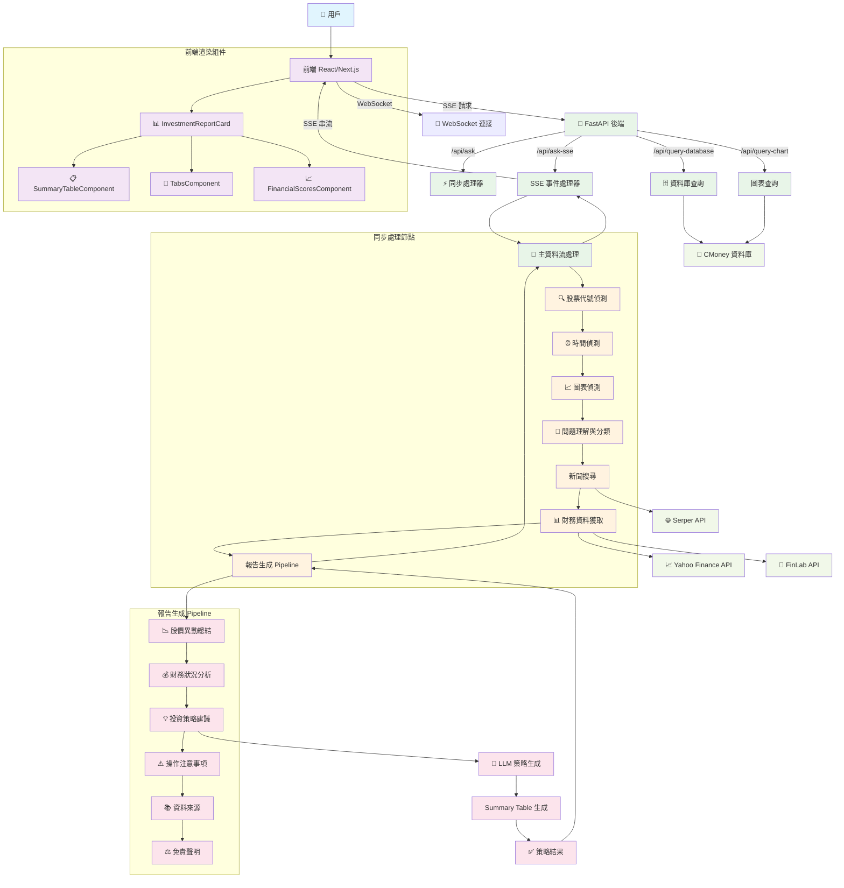

# 個股分析流程架構圖

```mermaid

graph TB
    %% 用戶層
    User[👤 用戶] --> Frontend[ 前端 React/Next.js]
    
    %% 前端層
    Frontend --> |SSE 請求| API[🚀 FastAPI 後端]
    Frontend --> |WebSocket| WS[🔌 WebSocket 連接]
    
    %% 後端 API 層
    API --> |/api/ask-sse| SSEHandler[ SSE 事件處理器]
    API --> |/api/ask| SyncHandler[⚡ 同步處理器]
    API --> |/api/query-database| DBHandler[🗄️ 資料庫查詢]
    API --> |/api/query-chart| ChartHandler[ 圖表查詢]
    
    %% 主要資料流處理
    SSEHandler --> MainFlow[🔄 主資料流處理]
    
    %% 同步處理節點 (Sequential Processing)
    subgraph "同步處理節點"
        MainFlow --> DetectStocks[🔍 股票代號偵測]
        DetectStocks --> DetectTime[⏰ 時間偵測]
        DetectTime --> DetectChart[📈 圖表偵測]
        DetectChart --> ClassifyExtract[🧠 問題理解與分類]
        ClassifyExtract --> NewsSearch[ 新聞搜尋]
        NewsSearch --> FinancialData[📊 財務資料獲取]
        FinancialData --> ReportPipeline[ 報告生成 Pipeline]
    end
    
    %% 報告生成 Pipeline (Sequential Section Generation)
    subgraph "報告生成 Pipeline"
        ReportPipeline --> PriceSummary[📉 股價異動總結]
        PriceSummary --> FinancialSection[💰 財務狀況分析]
        FinancialSection --> StrategySection[💡 投資策略建議]
        StrategySection --> NoticeSection[⚠️ 操作注意事項]
        NoticeSection --> SourcesSection[📚 資料來源]
        SourcesSection --> DisclaimerSection[⚖️ 免責聲明]
    end
    
    %% 投資策略建議 Section (包含 summary_table)
    StrategySection --> LLMStrategy[🤖 LLM 策略生成]
    LLMStrategy --> SummaryTable[ Summary Table 生成]
    SummaryTable --> StrategyResult[✅ 策略結果]
    
    %% 外部 API 整合
    NewsSearch --> SerperAPI[🌐 Serper API]
    FinancialData --> YahooFinance[📈 Yahoo Finance API]
    FinancialData --> FinLabAPI[🏦 FinLab API]
    
    %% 資料庫層
    DBHandler --> CMoneyDB[💾 CMoney 資料庫]
    ChartHandler --> CMoneyDB
    
    %% 前端渲染層
    subgraph "前端渲染組件"
        Frontend --> InvestmentCard[📊 InvestmentReportCard]
        InvestmentCard --> SummaryTableComponent[📋 SummaryTableComponent]
        InvestmentCard --> TabsComponent[📑 TabsComponent]
        InvestmentCard --> FinancialScores[📈 FinancialScoresComponent]
    end
    
    %% 資料流回傳
    StrategyResult --> ReportPipeline
    ReportPipeline --> MainFlow
    MainFlow --> SSEHandler
    SSEHandler --> |SSE 串流| Frontend
    
    %% 樣式定義
    classDef userLayer fill:#e1f5fe
    classDef frontendLayer fill:#f3e5f5
    classDef backendLayer fill:#e8f5e8
    classDef apiLayer fill:#fff3e0
    classDef dataLayer fill:#fce4ec
    classDef externalLayer fill:#f1f8e9
    
    class User userLayer
    class Frontend,InvestmentCard,SummaryTableComponent,TabsComponent,FinancialScores frontendLayer
    class API,SSEHandler,SyncHandler,DBHandler,ChartHandler,MainFlow backendLayer
    class DetectStocks,DetectTime,DetectChart,ClassifyExtract,NewsSearch,FinancialData,ReportPipeline apiLayer
    class PriceSummary,FinancialSection,StrategySection,NoticeSection,SourcesSection,DisclaimerSection,LLMStrategy,SummaryTable,StrategyResult dataLayer
    class SerperAPI,YahooFinance,FinLabAPI,CMoneyDB externalLayer
```
