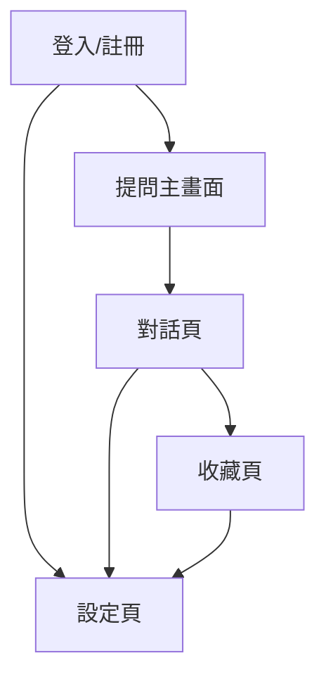

# MVP Sitemap

## Hierarchy Level 流程結構

1. 登入/註冊畫面
    1.1 Google 登入
    1.2 Email 註冊/登入（可選）
    1.3 忘記密碼
2. 提問主畫面
    2.1 問句輸入欄
    2.2 推薦卡（熱門主題/快速提問）
    2.3 熱門提問區
3. 對話頁
    3.1 AI 回覆（文字、圖卡）
    3.2 追問/補充問題
    3.3 收藏/取消收藏
4. 收藏頁
    4.1 歷史問答列表
    4.2 標籤分類/搜尋
    4.3 問答詳情檢視
5. 設定頁
    5.1 帳號資料檢視/編輯
    5.2 訂閱方案（僅顯示，初期不上線）
    5.3 登出

---

## 流程圖

---

## 各頁功能模組（原始清單，供參考）

### 1. 登入/註冊畫面
- Google 登入
- Email 註冊/登入（可選）
- 忘記密碼

### 2. 提問主畫面
- 問句輸入欄
- 推薦卡（熱門主題/快速提問）
- 熱門提問區

### 3. 對話頁
- AI 回覆（文字、圖卡）
- 追問/補充問題
- 收藏/取消收藏

### 4. 收藏頁
- 歷史問答列表
- 標籤分類/搜尋
- 問答詳情檢視

### 5. 設定頁
- 帳號資料檢視/編輯
- 訂閱方案（僅顯示，初期不上線）
- 登出 