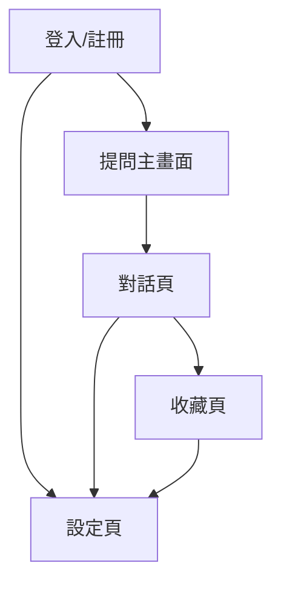

# MVP Sitemap

## 流程圖

## 各頁功能模組

### 1. 登入/註冊畫面
- Google 登入
- Email 註冊/登入（可選）
- 忘記密碼

### 2. 提問主畫面
- 問句輸入欄
- 推薦卡（熱門主題/快速提問）
- 熱門提問區

### 3. 對話頁
- AI 回覆（文字、圖卡）
- 追問/補充問題
- 收藏/取消收藏

### 4. 收藏頁
- 歷史問答列表
- 標籤分類/搜尋
- 問答詳情檢視

### 5. 設定頁
- 帳號資料檢視/編輯
- 訂閱方案（僅顯示，初期不上線）
- 登出 