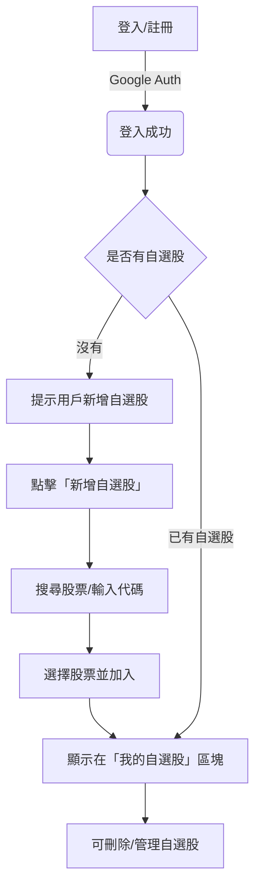

# 自選股 UX 流程

本文件說明 MVP 階段自選股功能的用戶體驗流程。

## 流程圖

```mermaid
flowchart TD
  A[登入/註冊] -->|Google Auth| B(登入成功)
  B --> C{是否有自選股}
  C -- 沒有 --> D[提示用戶新增自選股]
  D --> E[點擊「新增自選股」]
  E --> F[搜尋股票/輸入代碼]
  F --> G[選擇股票並加入]
  G --> H[顯示在「我的自選股」區塊]
  C -- 已有自選股 --> H
  H --> I[可刪除/管理自選股]
```

## 文字說明
1. 用戶登入（僅支援 Google Auth）
2. 登入後檢查是否已有自選股
3. 若沒有，提示用戶新增自選股
4. 用戶點擊「新增自選股」按鈕，彈出搜尋框
5. 用戶輸入股票名稱或代碼，選擇後加入
6. 加入後顯示在「我的自選股」區塊，可隨時刪除/管理 