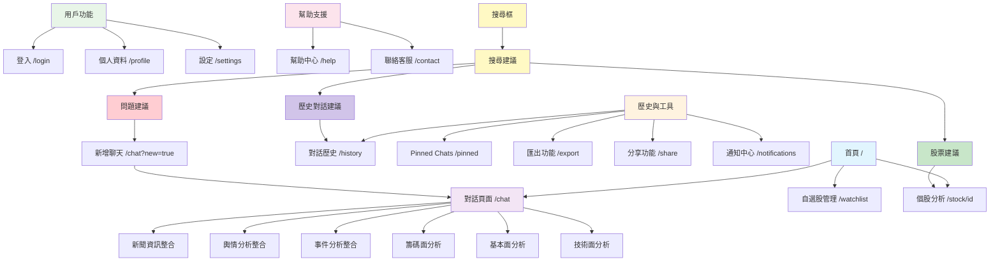
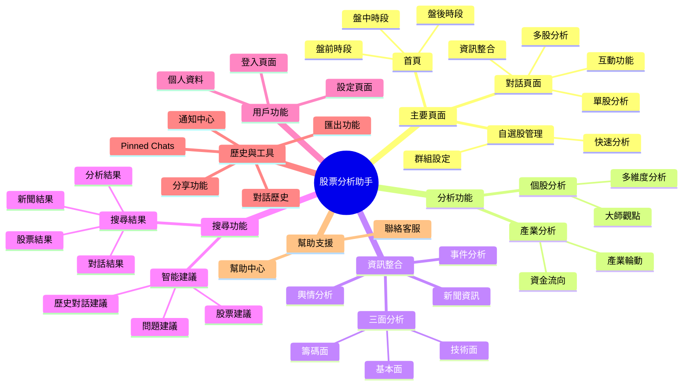

# 股票分析助手 - 網站地圖 (Sitemap)

## 📋 網站架構圖

### Flowchart 格式


### Mindmap 格式


### 層級結構 (Hierarchy)
```
股票分析助手
├── 主要頁面
│   ├── 首頁 (/) - v0 MVP
│   │   ├── 盤前時段 (06:00-09:00)
│   │   ├── 盤中時段 (09:00-13:30)
│   │   └── 盤後時段 (13:30-06:00)
│   ├── 對話頁面 (/chat) - v0 MVP
│   │   ├── 多股 sections (自選股摘要)
│   │   ├── 單股 sections (個股分析)
│   │   ├── 新聞資訊整合
│   │   ├── 輿情分析整合
│   │   ├── 事件分析整合
│   │   ├── Pin 功能
│   │   ├── 智能問題建議
│   │   └── v1 功能
│   │       ├── 按讚/倒讚設計
│   │       ├── Copy Information 功能
│   │       ├── Inline Feedback 設計
│   │       └── Regenerate 功能
│   └── 自選股管理 (/watchlist) - v0 MVP
│       ├── 自選股群組設定
│       ├── 快速分析入口
│       └── 跳轉到對話頁面
├── 分析功能
│   ├── 個股分析 (/stock/[id]) - v1 MVP
│   │   ├── 大師觀點 (技術、籌碼、基本面)
│   │   ├── 多維度分析
│   │   ├── 風險提醒
│   │   └── 操作建議
│   └── 產業分析 (/industry/[id]) - v3 MVP
│       ├── 產業輪動分析
│       ├── 資金流向
│       └── 相關股票清單
├── 資訊整合
│   ├── 新聞資訊 - v0 MVP
│   │   ├── 相關股票標記
│   │   ├── AI 影響分析
│   │   ├── 外部來源連結
│   │   └── 相關新聞推薦
│   ├── 輿情分析 - v0 MVP
│   │   ├── 同學會討論熱度
│   │   ├── 情緒分析圖表
│   │   ├── 熱門話題標籤
│   │   └── 外部社群連結
│   ├── 事件分析 - v0 MVP
│   │   ├── 事件時間軸
│   │   ├── 影響評估
│   │   ├── 相關股票分析
│   │   └── 外部資訊連結
│   ├── 籌碼面分析 - v0 MVP
│   │   ├── 法人買賣超分析
│   │   ├── 融資融券變化
│   │   ├── 分點進出分析
│   │   ├── 籌碼集中度分析
│   │   └── 具體圖表
│   │       ├── 法人買賣超趨勢圖
│   │       ├── 融資融券變化圖
│   │       ├── 分點進出熱力圖
│   │       └── 籌碼集中度雷達圖
│   ├── 基本面分析 - v0 MVP
│   │   ├── 財務報表分析
│   │   ├── 營收成長分析
│   │   ├── 獲利能力分析
│   │   ├── 產業地位分析
│   │   └── 具體圖表
│   │       ├── 營收成長趨勢圖
│   │       ├── 毛利率/淨利率圖
│   │       ├── 財務比率雷達圖
│   │       └── 產業比較圖
│   └── 技術面分析 - v1 MVP (Phase 2)
│       ├── 技術指標分析
│       ├── 支撐壓力位分析
│       ├── 型態分析
│       ├── 成交量分析
│       └── 具體圖表
│           ├── K線圖 + 技術指標
│           ├── 支撐壓力位標示圖
│           ├── 型態識別圖
│           └── 成交量分析圖
├── 用戶功能
│   ├── 登入頁面 (/login) - v0 MVP
│   │   ├── 多種登入方式
│   │   ├── 記住登入狀態
│   │   └── 自動跳轉
│   ├── 個人資料 (/profile) - v1 MVP
│   │   ├── 基本資料編輯
│   │   ├── 偏好設定
│   │   └── 會員狀態
│   └── 設定頁面 (/settings) - v0 MVP
│       ├── 主題切換 (Light/Dark)
│       ├── 通知設定
│       ├── 語言設定
│       └── 隱私設定
├── 歷史與工具
│   ├── 對話歷史 (/history) - v0 MVP
│   │   ├── 時間排序
│   │   ├── 搜尋功能
│   │   └── 分類標籤
│   ├── Pinned Chats (/pinned) - v0 MVP
│   │   ├── 快速訪問
│   │   ├── 重要分析收藏
│   │   └── 分享功能
│   ├── 匯出功能 (/export) - v1 MVP
│   │   ├── PDF 匯出
│   │   ├── Excel 匯出
│   │   └── 圖片分享
│   ├── 分享功能 (/share) - v0 MVP
│   │   ├── 社群分享
│   │   ├── 連結分享
│   │   └── 嵌入代碼
│   └── 通知中心 (/notifications) - v1 MVP
│       ├── 即時通知
│       ├── 歷史通知
│       └── 設定管理
├── 搜尋功能 (/search) - v0 MVP
│   ├── 股票代碼搜尋
│   ├── 公司名稱搜尋
│   ├── 新聞內容搜尋
│   ├── 歷史對話搜尋
│   ├── 智能關鍵字生成
│   ├── 搜尋結果過濾
│   ├── 搜尋標的加入自選股 - 快速加入功能
│   ├── 智能建議系統
│   │   ├── 股票建議 (點擊跳轉到個股頁面)
│   │   ├── 問題建議 (點擊自動新增聊天)
│   │   ├── 歷史對話建議 (點擊跳轉到歷史對話)
│   │   └── 即時搜尋建議 (輸入時動態顯示)
│   └── 搜尋結果分類
│       ├── 股票結果 (優先顯示)
│       ├── 新聞結果
│       ├── 對話結果
│       └── 分析結果
└── 幫助支援
    ├── 幫助中心 (/help) - v1 MVP
    │   ├── 常見問題
    │   ├── 使用教學
    │   └── 影片指南
    └── 聯絡客服 (/contact) - v1 MVP
        ├── 線上客服
        ├── 問題回報
        └── 建議反饋
```

## 🏠 主要頁面

### 首頁 (Home) - v0 MVP
- **路徑**: `/`
- **功能**: 時段導向首頁，根據時間自動切換內容
- **時段**:
  - 盤前 (06:00-09:00): 國際股市、台指期、隔日沖分析、法人動向
  - 盤中 (09:00-13:30): 即時監控、持股縮圖、異動提醒、熱門股排行
  - 盤後 (13:30-06:00): 今日總結、持股健康、籌碼分析、明日重點

### 對話頁面 (Chat) - v0 MVP
- **路徑**: `/chat`
- **功能**: 統一對話介面，支援多股和單股分析
- **特色**: 
  - 多股 sections (自選股摘要)
  - 單股 sections (個股分析)
  - 新聞資訊整合 (內嵌顯示 + 外部導流)
  - 輿情分析整合 (內嵌顯示 + 外部導流)
  - 事件分析整合 (內嵌顯示 + 外部導流)
  - Pin 功能
  - 智能問題建議
  - **v1 功能**:
    - 按讚/倒讚設計
    - Copy Information 功能
    - Inline Feedback 設計
    - Regenerate 功能 (整個回覆模組重新生成)

### 自選股管理 (Watchlist) - v0 MVP
- **路徑**: `/watchlist`
- **功能**: 自選股群組管理
- **特色**:
  - 自選股群組設定
  - 快速分析入口
  - 跳轉到對話頁面

## 📊 分析功能

### 個股分析 - v0 MVP
- **路徑**: `/stock/[id]`
- **功能**: 單一股票詳細分析
- **特色**:
  - 大師觀點 (技術、籌碼、基本面)
  - 多維度分析
  - 風險提醒
  - 操作建議

### 產業分析 - v3 MVP (Phase 4)
- **路徑**: `/industry/[id]`
- **功能**: 產業類股分析
- **特色**:
  - 產業輪動分析
  - 資金流向
  - 相關股票清單

## 🔍 資訊整合

### 新聞資訊 - v0 MVP
- **整合方式**: 對話頁面內嵌顯示
- **功能**: 新聞摘要和 AI 分析
- **特色**:
  - 相關股票標記
  - AI 影響分析
  - 外部來源連結 (導流到原始新聞網站)
  - 相關新聞推薦

### 輿情分析 - v0 MVP
- **整合方式**: 對話頁面內嵌顯示
- **功能**: 社群討論熱度分析
- **特色**:
  - 同學會討論熱度
  - 情緒分析圖表
  - 熱門話題標籤
  - 外部社群連結 (導流到同學會、PTT等)

### 事件分析 - v0 MVP
- **整合方式**: 對話頁面內嵌顯示
- **功能**: 重要事件影響分析
- **特色**:
  - 事件時間軸
  - 影響評估
  - 相關股票分析
  - 外部資訊連結 (導流到公開資訊觀測站等)

### 籌碼面分析 - v1 MVP (Phase 2)
- **整合方式**: 對話頁面內嵌顯示
- **功能**: 籌碼面深度分析
- **特色**:
  - 法人買賣超分析
  - 融資融券變化
  - 分點進出分析
  - 籌碼集中度分析
  - **具體圖表**:
    - 法人買賣超趨勢圖
    - 融資融券變化圖
    - 分點進出熱力圖
    - 籌碼集中度雷達圖

### 基本面分析 - v1 MVP (Phase 2)
- **整合方式**: 對話頁面內嵌顯示
- **功能**: 基本面深度分析
- **特色**:
  - 財務報表分析
  - 營收成長分析
  - 獲利能力分析
  - 產業地位分析
  - **具體圖表**:
    - 營收成長趨勢圖
    - 毛利率/淨利率圖
    - 財務比率雷達圖
    - 產業比較圖

### 技術面分析 - v1 MVP (Phase 2)
- **整合方式**: 對話頁面內嵌顯示
- **功能**: 技術面深度分析
- **特色**:
  - 技術指標分析
  - 支撐壓力位分析
  - 型態分析
  - 成交量分析
  - **具體圖表**:
    - K線圖 + 技術指標
    - 支撐壓力位標示圖
    - 型態識別圖
    - 成交量分析圖

## 👤 用戶功能

### 登入頁面 - v0 MVP
- **路徑**: `/login`
- **功能**: 用戶登入
- **特色**:
  - 多種登入方式
  - 記住登入狀態
  - 自動跳轉

### 個人資料 - v1 MVP
- **路徑**: `/profile`
- **功能**: 用戶資料管理
- **特色**:
  - 基本資料編輯
  - 偏好設定
  - 會員狀態

### 設定頁面 - v0 MVP
- **路徑**: `/settings`
- **功能**: 系統設定
- **特色**:
  - 主題切換 (Light/Dark)
  - 通知設定
  - 語言設定
  - 隱私設定

## 📚 歷史與收藏

### 對話歷史 - v0 MVP
- **路徑**: `/history`
- **功能**: 歷史對話記錄
- **特色**:
  - 時間排序
  - 搜尋功能
  - 分類標籤

### Pinned Chats - v0 MVP
- **路徑**: `/pinned`
- **功能**: 標記的重要對話
- **特色**:
  - 快速訪問
  - 重要分析收藏
  - 分享功能

## 🔧 工具功能

### 匯出功能 - v1 MVP
- **路徑**: `/export`
- **功能**: 內容匯出
- **特色**:
  - PDF 匯出
  - Excel 匯出
  - 圖片分享

### 分享功能 - v0 MVP
- **路徑**: `/share`
- **功能**: 內容分享
- **特色**:
  - 社群分享
  - 連結分享
  - 嵌入代碼

### 通知中心 - v1 MVP
- **路徑**: `/notifications`
- **功能**: 系統通知
- **特色**:
  - 即時通知
  - 歷史通知
  - 設定管理

### 搜尋功能 - v0 MVP
- **路徑**: `/search`
- **功能**: 全站搜尋
- **特色**:
  - 股票代碼搜尋
  - 公司名稱搜尋
  - 新聞內容搜尋
  - 歷史對話搜尋
  - 智能關鍵字生成
  - 搜尋結果過濾
  - **智能建議系統**:
    - 股票建議 (點擊跳轉到個股頁面 `/stock/[id]`)
    - 問題建議 (點擊自動新增聊天 `/chat?new=true`)
    - 歷史對話建議 (點擊跳轉到歷史對話)
    - 即時搜尋建議 (輸入時動態顯示)
  - **搜尋結果分類**:
    - 股票結果 (優先顯示)
    - 新聞結果
    - 對話結果
    - 分析結果

## 📖 幫助與支援

### 幫助中心 - v1 MVP
- **路徑**: `/help`
- **功能**: 使用說明
- **特色**:
  - 常見問題
  - 使用教學
  - 影片指南

### 聯絡客服 - v1 MVP
- **路徑**: `/contact`
- **功能**: 客服聯絡
- **特色**:
  - 線上客服
  - 問題回報
  - 建議反饋

## 📊 數據與分析

### 即時數據 - v0 MVP
- **路徑**: `/data/realtime`
- **功能**: 即時股價數據
- **特色**:
  - 股價即時更新
  - 成交量監控
  - 漲跌幅計算
  - 技術指標即時計算

### 歷史數據 - v1 MVP
- **路徑**: `/data/historical`
- **功能**: 歷史數據查詢
- **特色**:
  - 股價歷史走勢
  - 成交量歷史
  - 技術指標歷史
  - 數據匯出功能

### 市場概況 - v0 MVP
- **路徑**: `/market/overview`
- **功能**: 整體市場分析
- **特色**:
  - 大盤指數監控
  - 產業輪動分析
  - 資金流向分析
  - 市場情緒指標

## 🔔 警報系統

### 價格警報 - v1 MVP
- **路徑**: `/alerts/price`
- **功能**: 價格變動警報
- **特色**:
  - 價格突破警報
  - 漲跌幅警報
  - 成交量異常警報
  - 自定義警報條件

### 技術警報 - v1 MVP
- **路徑**: `/alerts/technical`
- **功能**: 技術指標警報
- **特色**:
  - 均線突破警報
  - RSI 超買超賣警報
  - MACD 金叉死叉警報
  - 支撐壓力位警報

### 新聞警報 - v1 MVP
- **路徑**: `/alerts/news`
- **功能**: 重要新聞警報
- **特色**:
  - 重大事件警報
  - 財報發布警報
  - 法人動向警報
  - 產業政策警報

## 🏗️ 開發與測試

### 測試頁面
- **路徑**: `/test`
- **功能**: 功能測試
- **特色**:
  - API 測試
  - 元件測試
  - 效能測試

### 開發工具
- **路徑**: `/dev`
- **功能**: 開發者工具
- **特色**:
  - API 文檔
  - 除錯工具
  - 日誌查看

## 📱 響應式設計

### 桌面版
- 完整功能顯示
- 側邊欄固定
- 多欄位佈局

### 平板版
- 適配螢幕尺寸
- 側邊欄可收合
- 觸控優化

### 手機版
- 簡化佈局
- 重點功能優先
- 手勢操作

## 🗓️ 開發時程規劃

### Phase 1 (v0 MVP) - 4週
**目標**: 核心功能上線
- 首頁時段導向設計
- 對話頁面基礎功能
- 自選股管理
- 搜尋功能 (包含搜尋標的加入自選股)
- 財報資料整合
- 籌碼資料整合
- 用戶登入系統
- 基本會員權限

### Phase 2 (v1 MVP) - 4週
**目標**: 進階分析功能
- 個股分析頁面 (大師觀點、多維度分析)
- 盤前盤中盤後首頁 (進階時段分析)
- 對話頁面互動功能 (按讚/倒讚、Copy、Feedback、Regenerate)
- 警報系統
- 歷史數據
- 匯出功能
- 個人資料管理

### Phase 3 (v2 MVP) - 4週
**目標**: 數據整合與優化
- 即時數據系統
- 市場概況分析
- 通知中心
- 幫助支援系統
- 進階會員功能

### Phase 4 (v3 MVP) - 4週
**目標**: 產業分析與進階功能
- 產業分析系統
- 進階圖表功能
- API 系統
- 專業用戶功能

**總開發時程**: 16週 (約4個月)

## 🔐 會員系統規劃

### 免費用戶 (Free)
- **功能限制**:
  - 每日 10 次 AI 分析
  - 基本自選股管理 (最多 10 檔)
  - 基礎搜尋功能
  - 基本對話歷史 (最近 30 天)
- **數據限制**:
  - 即時股價 (延遲 15 分鐘)
  - 基礎技術指標
  - 基本新聞資訊

### 進階用戶 (Pro) - $299/月
- **功能升級**:
  - 無限制 AI 分析
  - 進階自選股管理 (最多 50 檔)
  - 完整搜尋功能
  - 完整對話歷史
  - 三面分析功能
  - 警報系統
  - 匯出功能
- **數據升級**:
  - 即時股價 (無延遲)
  - 完整技術指標
  - 詳細籌碼面數據
  - 基本面財務數據
  - 歷史數據查詢

### 專業用戶 (Premium) - $599/月
- **功能升級**:
  - 所有 Pro 功能
  - 產業分析系統
  - API 存取權限
  - 專屬客服支援
  - 客製化報告
  - 進階圖表功能
- **數據升級**:
  - 所有數據無限制
  - 機構級數據
  - 預測模型數據
  - 專屬數據分析

### 企業用戶 (Enterprise) - 客製化
- **功能升級**:
  - 所有 Premium 功能
  - 多用戶管理
  - 客製化整合
  - 專屬部署
  - 培訓支援
- **數據升級**:
  - 專屬數據源
  - 客製化數據分析
  - 企業級 API

---

## 📋 更新記錄

- **2025-01-15**: 初始版本
- **2025-01-15**: 加入時段導向設計
- **2025-01-15**: 新增 Pin 功能和 Section 互動
- **2025-01-15**: 優化盤前時段內容架構
- **2025-01-15**: 加入版本規劃 (v0 MVP / v1 MVP / v2 MVP / v3 MVP)
- **2025-01-15**: 新增對話頁面互動功能 (按讚/倒讚、Copy、Feedback、Regenerate)
- **2025-01-15**: 新增三面分析 (籌碼面、基本面、技術面) 與具體圖表規劃
- **2025-01-15**: 移除收藏內容功能 (與 Pinned Chats 重疊)
- **2025-01-15**: 新增網站架構圖 (Flowchart、Mindmap、Hierarchy)
- **2025-01-15**: 新增搜尋功能、數據分析、警報系統等缺失功能
- **2025-01-15**: 新增搜尋智能建議系統 (股票建議、問題建議、歷史對話建議)
- **2025-01-15**: 調整功能規劃時程，產業分析移至 Phase 4
- **2025-01-15**: 新增會員系統規劃，移除獨立新聞/輿情頁面
- **2025-01-15**: 修正 Mermaid 語法錯誤和格式問題
- **2025-01-15**: 調整 v0/v1 MVP 功能分配
  - 個股分析頁面移至 v1 MVP
  - 財報資料、籌碼資料移至 v0 MVP
  - 新增搜尋標的加入自選股功能至 v0 MVP
  - 盤前盤中盤後首頁移至 v1 MVP 