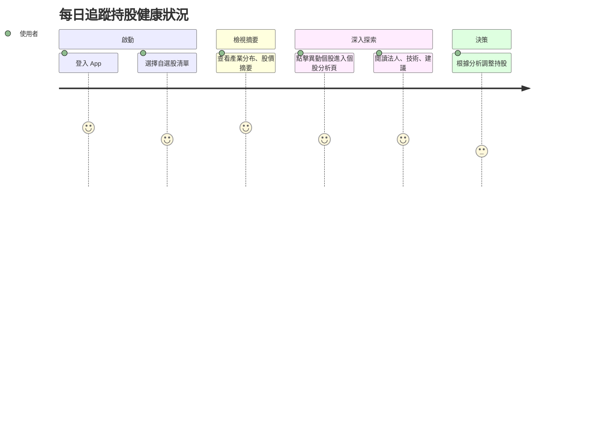

# 用戶旅程 × MVP 覆蓋表

| 用戶旅程階段 | 典型行為 / 需求 | 目前 MVP 覆蓋情境 | 是否已支援 | 備註 |
|--------------|------------------|--------------------|------------|------|
| 1. 啟動動機 | 想快速了解自己關注的股票今天表現如何 | 開啟 App → 顯示自選股摘要卡片 | ✅ | 支援自選股產業分布、表現排行 |
| 2. 初步觀察 | 想知道整體市場與我的股票今天發生了什麼事 | 產出股價摘要 / 報酬率圖表 | ✅ | 基本呈現已完成，尚可強化 insight 呈現 |
| 3. 深入理解 | 想知道個股漲跌原因、財務數據、法人動向、技術面 | 產出個股報告：異動說明、財務分析、法人行為對照 | ✅ | 報告架構已建立，可再精簡化模板 |
| 4. 情緒參考 | 想看看大家對這檔股票怎麼看、有沒有共識或爭議 | 同學會輿論摘要（討論數、情緒分布、主題提取） | ✅（開發中） | 整合中，情緒判斷邏輯待優化 |
| 5. 決策思考 | 想知道該不該買 / 該不該抱著 / 有哪些變數需觀察 | 投資建議區塊：分時框架建議（短線/中期/長期） | ✅ | 策略語氣保持中立、可補充觀察指標 |
| 6. 延伸行動 | 想收藏報告、追蹤類似股票、加入 watchlist | 尚未實作 | ❌ | 可設計為收藏區或推薦卡片 |
| 7. 滿足回饋 | 想追問更多內容或推薦給朋友 | 尚未設計二次互動 | ❌ | 可加入「追問」、「延伸問題」入口 |

---

# 旅程一：每日追蹤持股健康狀況

## 🎯 使用者動機
有固定持股、自選股清單的投資者，想快速確認手上持股是否異常、是否有法人動作或題材機會。

## 👣 用戶行為路徑

## 參考目標

### 任務主張
- 建立價值主張：「只要匯入自選股，就能看到不同面向／大師對你的持股健康檢查」

### ✅ 使用者旅程思考
- 思考使用者旅程，針對不同使用場景設計對應的 wireframe。

### ✅ 功能/介面建議與想像（舉例）
- 開啟 App 後：
  - 若帳號內有自選股，首頁直接顯示自選股的大師評價
  - 顯示持股健康度摘要、異常股提醒（如跑馬燈或圖示）
  - 點擊異常提示 → 進入該個股 AI 分析頁
- 在 個股 AI 分析頁：
  - 顯示來自不同面向（籌碼、財報、技術、輿情）的評價
  - 使用者可選擇某一觀點（ex：大師A 的評價），系統會以這個觀點呈現完整分析
  - 提供對應的個股評價回饋使用者 