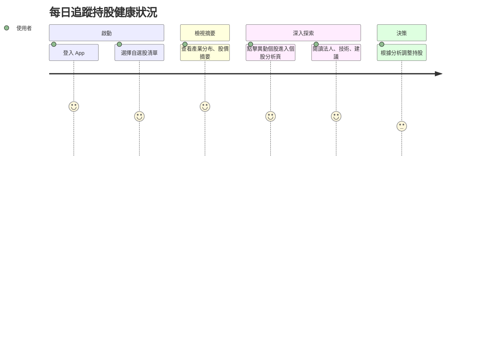

# 旅程一：每日追蹤持股健康狀況

## 🎯 使用者動機
有固定持股、自選股清單的投資者，想快速確認手上持股是否異常、是否有法人動作或題材機會。

## 👣 用戶行為路徑

## 參考目標

### 任務主張
- 建立價值主張：「只要匯入自選股，就能看到不同面向／大師對你的持股健康檢查」

### ✅ 使用者旅程思考
- 思考使用者旅程，針對不同使用場景設計對應的 wireframe。

### ✅ 功能/介面建議與想像（舉例）
- 開啟 App 後：
  - 若帳號內有自選股，首頁直接顯示自選股的大師評價
  - 顯示持股健康度摘要、異常股提醒（如跑馬燈或圖示）
  - 點擊異常提示 → 進入該個股 AI 分析頁
- 在 個股 AI 分析頁：
  - 顯示來自不同面向（籌碼、財報、技術、輿情）的評價
  - 使用者可選擇某一觀點（ex：大師A 的評價），系統會以這個觀點呈現完整分析
  - 提供對應的個股評價回饋使用者 