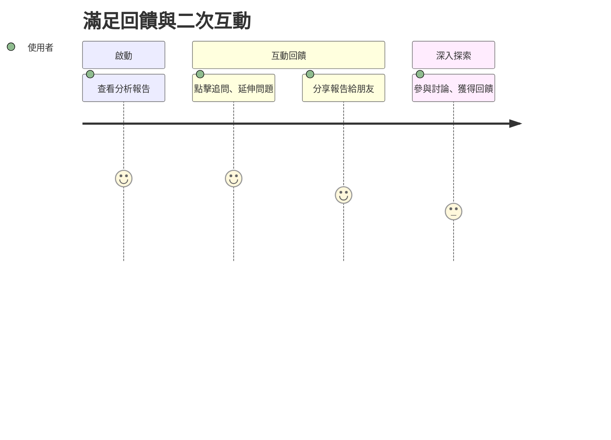

# 旅程七：滿足回饋與二次互動

## 🎯 使用者動機
想追問更多內容或推薦給朋友，獲得更深層的互動與回饋。

## 👣 用戶行為路徑

## 參考目標

### 任務主張
- 提供二次互動與回饋機制，提升用戶參與度與滿意度。

### ✅ 使用者旅程思考
- 設計追問、延伸問題、分享等互動功能。

### ✅ 功能/介面建議與想像（舉例）
- 報告頁可追問、延伸問題
- 分享報告給朋友
- 參與討論、獲得社群回饋 