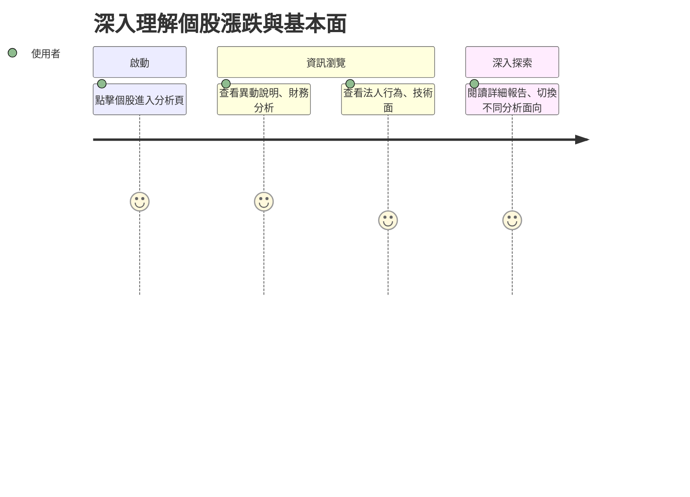

# 旅程三：深入理解個股漲跌與基本面

## 🎯 使用者動機
想知道個股漲跌原因、財務數據、法人動向、技術面，深入理解持股背後的驅動因素。

## 👣 用戶行為路徑

## 參考目標

### 任務主張
- 幫助用戶深入理解個股漲跌背後的多元因素。

### ✅ 使用者旅程思考
- 分析報告結構，讓用戶可切換不同面向（財報、法人、技術、輿情）。

### ✅ 功能/介面建議與想像（舉例）
- 個股分析頁顯示異動說明、法人動向、技術面摘要
- 報告可切換不同分析面向
- 提供精簡化模板與重點摘要 