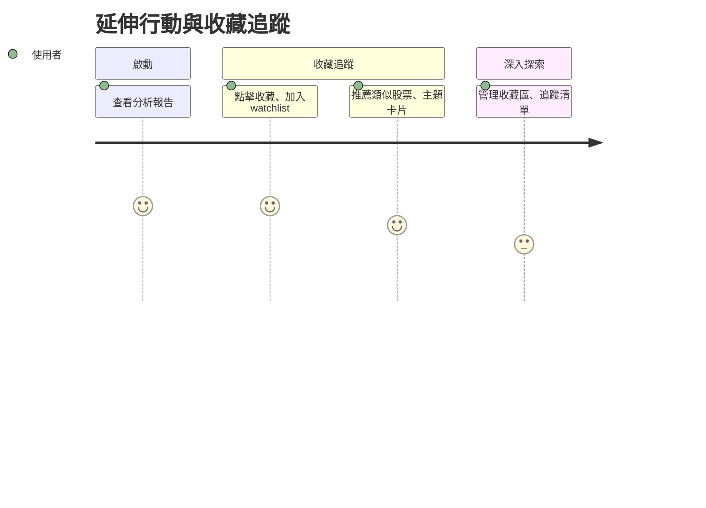

# 旅程六：延伸行動與收藏追蹤

## 🎯 使用者動機
想收藏報告、追蹤類似股票、加入 watchlist，方便後續追蹤與管理。

## 👣 用戶行為路徑

## 參考目標

### 任務主張
- 協助用戶延伸行動，方便管理與追蹤持股與感興趣標的。

### ✅ 使用者旅程思考
- 設計收藏、推薦、追蹤等功能。

### ✅ 功能/介面建議與想像（舉例）
- 報告頁可收藏、加入 watchlist
- 推薦類似股票、主題卡片
- 收藏區、追蹤清單管理 