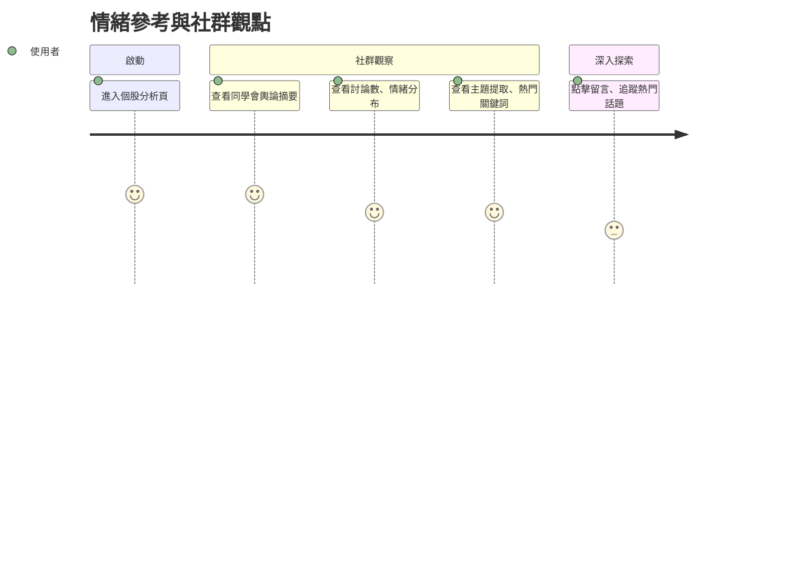

# 旅程四：情緒參考與社群觀點

## 🎯 使用者動機
想看看大家對這檔股票怎麼看、有沒有共識或爭議，參考社群情緒與熱門話題。

## 👣 用戶行為路徑

## 參考目標

### 任務主張
- 整合社群情緒與熱門話題，協助用戶判斷市場共識或分歧。

### ✅ 使用者旅程思考
- 設計情緒分布、主題提取等資訊呈現。

### ✅ 功能/介面建議與想像（舉例）
- 個股頁顯示社群討論數、情緒分布
- 熱門主題、關鍵詞雲
- 可點擊留言、追蹤話題 