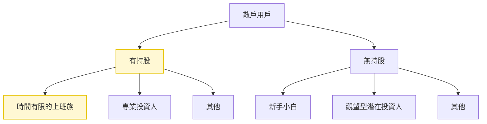
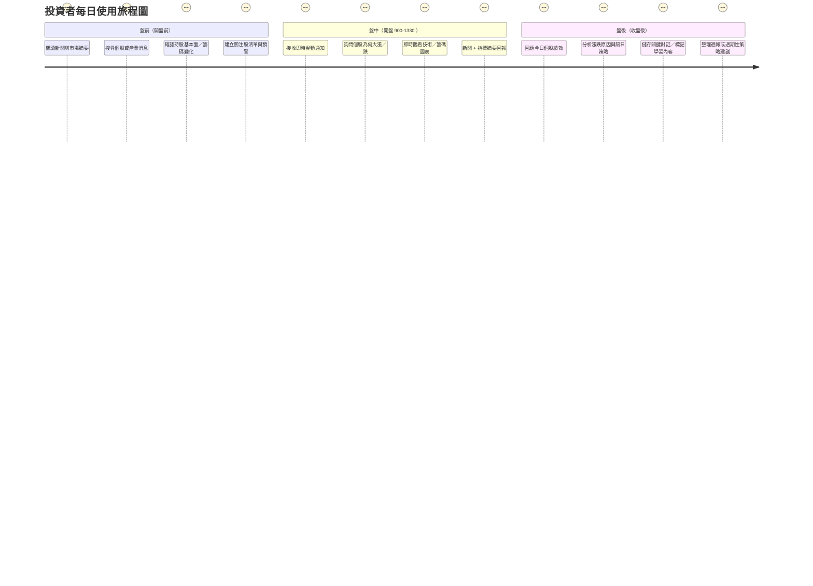
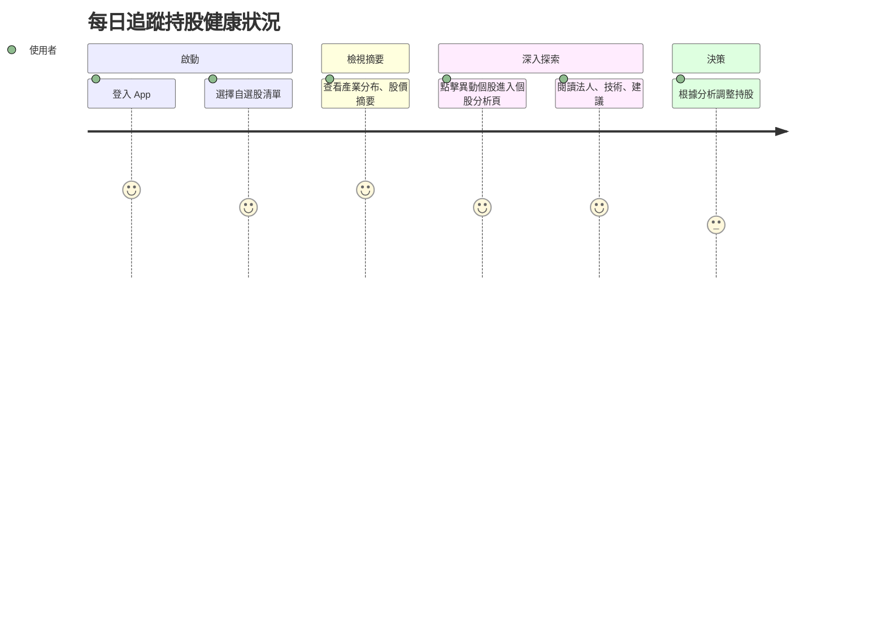

# user\_journey\_map

## 用戶旅程 × MVP 覆蓋表

### 🎯 MECE TA 梳理

#### 目標用戶 (Target Audience)

**有持股的上班族投資者 (黃色部分）**

* **Mutually Exclusive 特徵**：
  * 有固定持股組合（非純新手）
  * 上班族/家庭主婦等（時間有限、非專業操盤手/投資人）
  * 每天花 10-30 分鐘研究股票

#### 投資決策時段分析

| 時段     | 時間                   | 用戶需求          | 核心功能             | 決策重點     |
| ------ | -------------------- | ------------- | ---------------- | -------- |
| **盤前** | 08:00-09:00 上班前時段    | 了解今日市場預期、持股風險 | 市場預警、持股健康檢查      | 是否調整開盤策略 |
| **盤中** | 12:00-13:00 午休，吃午餐時  | 監控持股表現、即時異動   | 即時監控、異動提醒、急漲急跌原因 | 是否執行交易決策 |
| **盤後** | 16:00-睡覺前的空閒時間       | 分析今日表現、籌碼動向   | 盤後分析、籌碼追蹤        | 明日策略規劃   |

***

### 📊 MVP 功能覆蓋

| 用戶旅程階段  | 典型行為 / 需求       | 目前 MVP 覆蓋情境 | 是否已支援  | 時段對應   |
| ------- | --------------- | ----------- | ------ | ------ |
| 1. 盤前準備 | 快速了解持股健康狀況、市場預期 | 自選股摘要、市場預警  | ✅      | 盤前、全時段 |
| 2. 盤中監控 | 監控持股表現、即時異動提醒   | 即時股價追蹤、異動通知 | ✅（優化中） | 盤中、全時段 |
| 3. 盤後分析 | 深入分析今日表現、籌碼動向   | 個股報告、法人動向分析 | ✅      | 盤後、全時段 |
| 4. 情緒參考 | 了解市場情緒、輿論風向     | 同學會輿論摘要     | ✅（開發中） | 全時段    |
| 5. 決策輔助 | 基於分析做出投資決策      | 投資建議、風險提醒   | ✅      | 全時段    |
| 6. 延伸行動 | 收藏報告、追蹤相關股票     | 收藏功能、推薦系統   | ❌      | 全時段    |
| 7. 持續優化 | 追問細節、個人化設定      | 二次互動、個人化    | ❌      | 全時段    |

***

### 🚀 核心價值主張

&#x20;**只要匯入持股，就能獲得專屬投資大師分析**

異常匯報 + 持股健檢 + 輿情分析 + 多空觀點，大師觀點全面把關

針對上班族投資者一天當中不同時間的用戶行為＋ action

* **開盤前 30分鐘**：快速掌握持股健康狀況，掌握市場方向，決定今天要不要買賣股票
* **盤中**：即時監控股價變化，若自選股股價有異動時，歸因分析，找出股價變化原因，倂給出客觀建議
* **三四點後**：深度分析今日持股表現，籌碼異動推播：針對自選股的籌碼變化做一個總結，同

#### AI 輔助決策的獨特價值

* **多維度分析**：結合技術面、籌碼面、基本面、情緒面
* **個人化建議**：基於用戶持股組合的客製化分析
* **時間效率**：將原本需要 1-2 小時的研究濃縮為 10 分鐘內完成

***

### 📱 用戶旅程設計原則

#### 1. 時間導向設計

* 每個時段都有明確的資訊優先級
* 介面設計符合該時段的用戶心理狀態
* 提供快速入口與深度分析的分層設計

#### 2. 個人化體驗

* 基於用戶持股組合的客製化內容
* 學習用戶偏好，優化推薦算法
* 提供個人化的風險提醒與機會提示

#### 3. 決策支援

* 提供客觀的數據分析，避免情緒化決策
* 多角度觀點，幫助用戶全面思考
* 明確的風險提示與建議框架

***

## 旅程一：每日追蹤持股健康狀況

### 🎯 使用者動機

有固定持股、自選股清單的投資者，想快速確認手上持股是否異常、是否有法人動作或題材機會。

### 👣 用戶行為路徑

### 參考目標

#### 任務主張

* 建立價值主張：「只要匯入自選股，就能看到不同面向／大師對你的持股健康檢查」

#### ✅ 使用者旅程思考

* 思考使用者旅程，針對不同使用場景設計對應的 wireframe。

#### ✅ 功能/介面建議與想像（舉例）

* 開啟 App 後：
  * 若帳號內有自選股，首頁直接顯示自選股的大師評價
  * 顯示持股健康度摘要、異常股提醒（如跑馬燈或圖示）
  * 點擊異常提示 → 進入該個股 AI 分析頁
* 在 個股 AI 分析頁：
  * 顯示來自不同面向（籌碼、財報、技術、輿情）的評價
  * 使用者可選擇某一觀點（ex：大師A 的評價），系統會以這個觀點呈現完整分析
  * 提供對應的個股評價回饋使用者
