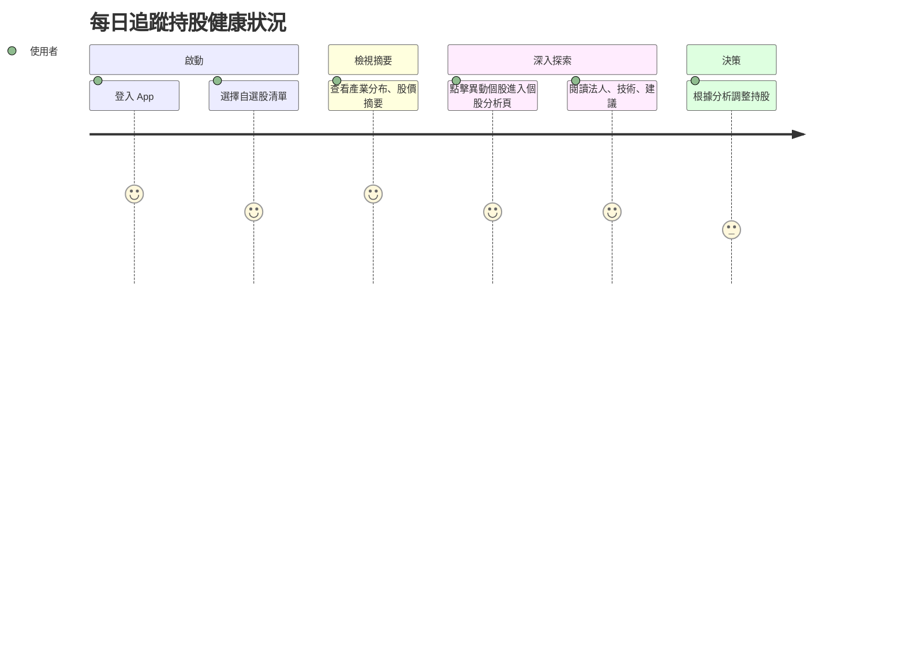

# 用戶旅程 × MVP 覆蓋表

## 🎯 MECE TA 梳理

### 目標用戶 (Target Audience)
**有持股的上班族投資者**
- **Mutually Exclusive 特徵**：
  - 有固定持股組合（非純新手）
  - 上班族身份（時間有限）
  - 每天花 10-30 分鐘研究股票
  - 不排斥使用 AI 工具輔助決策

### 投資決策時段分析 (Collectively Exhaustive)
| 時段 | 時間 | 用戶需求 | 核心功能 | 決策重點 |
|------|------|----------|----------|----------|
| **盤前** | 08:00-09:00 | 了解今日市場預期、持股風險 | 市場預警、持股健康檢查 | 是否調整開盤策略 |
| **盤中** | 12:00-13:00 | 監控持股表現、即時異動 | 即時監控、異動提醒 | 是否執行交易決策 |
| **盤後** | 16:00-18:00 | 分析今日表現、籌碼動向 | 盤後分析、籌碼追蹤 | 明日策略規劃 |

---

## 📊 MVP 功能覆蓋分析

| 用戶旅程階段 | 典型行為 / 需求 | 目前 MVP 覆蓋情境 | 是否已支援 | 時段對應 |
|--------------|------------------|--------------------|------------|----------|
| 1. 盤前準備 | 快速了解持股健康狀況、市場預期 | 自選股摘要、市場預警 | ✅ | 盤前 |
| 2. 盤中監控 | 監控持股表現、即時異動提醒 | 即時股價追蹤、異動通知 | 🔄 | 盤中 |
| 3. 盤後分析 | 深入分析今日表現、籌碼動向 | 個股報告、法人動向分析 | ✅ | 盤後 |
| 4. 情緒參考 | 了解市場情緒、輿論風向 | 同學會輿論摘要 | ✅（開發中） | 全時段 |
| 5. 決策輔助 | 基於分析做出投資決策 | 投資建議、風險提醒 | ✅ | 全時段 |
| 6. 延伸行動 | 收藏報告、追蹤相關股票 | 收藏功能、推薦系統 | ❌ | 全時段 |
| 7. 持續優化 | 追問細節、個人化設定 | 二次互動、個人化 | ❌ | 全時段 |

---

## 🚀 核心價值主張

### 針對上班族投資者的時間優化
- **盤前 5 分鐘**：快速掌握持股健康狀況，預判今日風險
- **盤中 10 分鐘**：即時監控關鍵異動，把握交易機會  
- **盤後 15 分鐘**：深度分析今日表現，規劃明日策略

### AI 輔助決策的獨特價值
- **多維度分析**：結合技術面、籌碼面、基本面、情緒面
- **個人化建議**：基於用戶持股組合的客製化分析
- **時間效率**：將原本需要 1-2 小時的研究濃縮為 30 分鐘內完成

---

## 📱 用戶旅程設計原則

### 1. 時間導向設計
- 每個時段都有明確的資訊優先級
- 介面設計符合該時段的用戶心理狀態
- 提供快速入口與深度分析的分層設計

### 2. 個人化體驗
- 基於用戶持股組合的客製化內容
- 學習用戶偏好，優化推薦算法
- 提供個人化的風險提醒與機會提示

### 3. 決策支援
- 提供客觀的數據分析，避免情緒化決策
- 多角度觀點，幫助用戶全面思考
- 明確的風險提示與建議框架

---

# 旅程一：每日追蹤持股健康狀況

## 🎯 使用者動機
有固定持股、自選股清單的投資者，想快速確認手上持股是否異常、是否有法人動作或題材機會。

## 👣 用戶行為路徑

## 參考目標

### 任務主張
- 建立價值主張：「只要匯入自選股，就能看到不同面向／大師對你的持股健康檢查」

### ✅ 使用者旅程思考
- 思考使用者旅程，針對不同使用場景設計對應的 wireframe。

### ✅ 功能/介面建議與想像（舉例）
- 開啟 App 後：
  - 若帳號內有自選股，首頁直接顯示自選股的大師評價
  - 顯示持股健康度摘要、異常股提醒（如跑馬燈或圖示）
  - 點擊異常提示 → 進入該個股 AI 分析頁
- 在 個股 AI 分析頁：
  - 顯示來自不同面向（籌碼、財報、技術、輿情）的評價
  - 使用者可選擇某一觀點（ex：大師A 的評價），系統會以這個觀點呈現完整分析
  - 提供對應的個股評價回饋使用者 