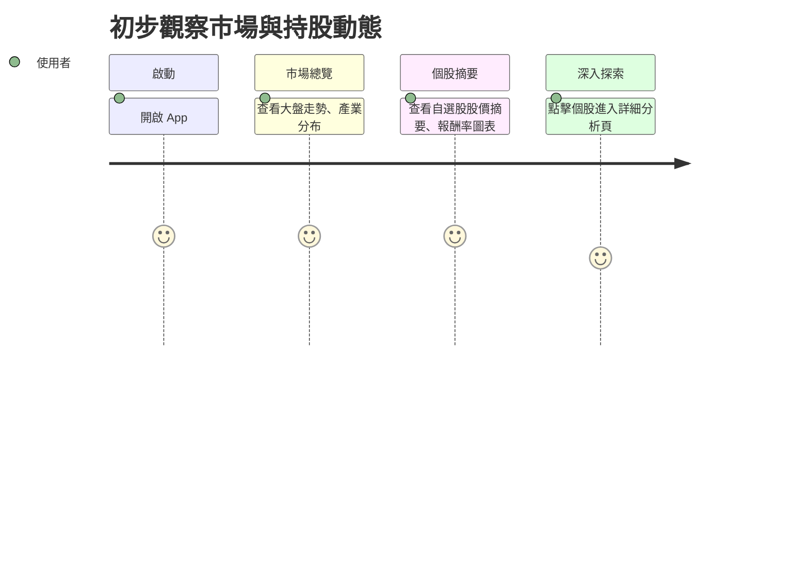

# 旅程二：初步觀察市場與持股動態

## 🎯 使用者動機
想知道整體市場與我的股票今天發生了什麼事，快速掌握大盤與自選股的異動。

## 👣 用戶行為路徑

## 參考目標

### 任務主張
- 幫助用戶快速掌握市場與自選股的整體動態。

### ✅ 使用者旅程思考
- 針對「市場總覽」與「個股摘要」設計資訊呈現與互動。

### ✅ 功能/介面建議與想像（舉例）
- 首頁顯示大盤走勢、產業分布圖
- 自選股區塊顯示今日漲跌、報酬率排行
- 點擊個股可進入詳細分析頁 