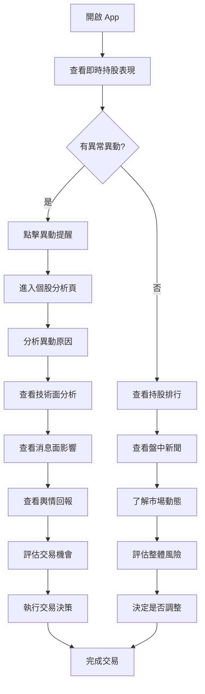
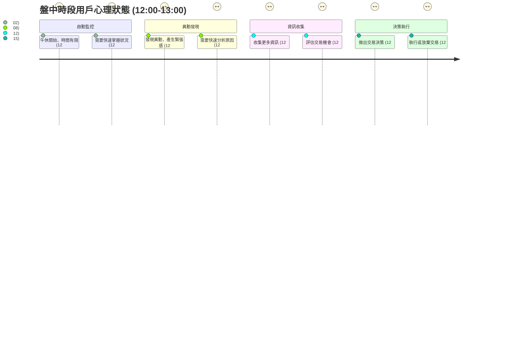

# 旅程二：盤中即時監控 (12:00-13:00)

## 🎯 使用者動機
上班族在午休時間快速監控持股表現，把握即時異動機會，執行交易決策。

## 👥 目標用戶特徵
- **時間限制**：午休時間 30-60 分鐘，實際可用 10-15 分鐘
- **心理狀態**：需要快速判斷是否執行交易
- **決策需求**：是否加減碼、是否調整持股配置

## 👣 用戶行為路徑

```mermaid
journey
    title 盤中即時監控
    section 啟動 (12:00-12:02)
      開啟 App: 5: 使用者
      查看即時持股表現: 5: 使用者
    section 異動監控 (12:02-12:08)
      檢查異常異動提醒: 4: 使用者
      查看股價漲跌原因分析: 4: 使用者
    section 資訊補充 (12:08-12:12)
      查看盤中新聞即時摘要: 4: 使用者
      查看同學會即時輿情回報: 3: 使用者
    section 交易決策 (12:12-12:15)
      分析異動原因: 3: 使用者
      決定是否執行交易: 3: 使用者
```

## 🔄 詳細用戶流程



## 🕐 時段分析



## 📊 盤中資訊需求分析

### 1. 即時持股監控
**用戶需求**：快速了解持股即時表現
- **即時報價**：持股即時價格、漲跌幅、成交量
- **異動提醒**：異常漲跌、成交量放大
- **表現排行**：持股表現排序，快速識別強弱股

### 2. 股價漲跌原因分析
**用戶需求**：了解股價異動的背後原因
- **技術面分析**：即時技術指標、支撐壓力位
- **消息面分析**：即時消息對股價的影響
- **資金面分析**：資金流向、買賣力道分析

### 3. 盤中資訊補充
**用戶需求**：獲得即時市場資訊輔助決策
- **盤中新聞**：即時財經新聞、公司消息
- **輿情回報**：同學會即時討論熱度、情緒變化
- **市場動態**：即時市場熱點、題材輪動

## 🎨 介面設計重點

### 監控首頁設計
```
┌─────────────────────────────────────┐
│ 📱 即時監控 (12:30)                 │
│ 📈 大盤：17,850 +0.8%               │
├─────────────────────────────────────┤
│ ⚠️ 即時異動提醒                     │
│ 2330 台積電 +3.2% 成交量放大 150%   │
│ 2317 鴻海 -2.1% 技術面跌破支撐      │
├─────────────────────────────────────┤
│ 📰 盤中新聞摘要                     │
│ • 台積電獲大單，股價大漲            │
│ • AI概念股集體上漲                  │
│ • 同學會討論熱度：台積電 1,200+     │
├─────────────────────────────────────┤
│ 📊 持股表現排行                     │
│ 1. 2454 聯發科 +2.8% ⭐⭐⭐⭐⭐     │
│ 2. 2330 台積電 +3.2% ⭐⭐⭐⭐      │
│ 3. 2317 鴻海 -2.1% ⚠️ 需關注       │
└─────────────────────────────────────┘
```

### 異動提醒設計
- **即時推送**：重要異動即時推播通知
- **分級提醒**：輕微/重要/緊急三級分類
- **快速操作**：一鍵進入詳細分析或交易頁面

## 💡 用戶體驗優化

### 1. 即時性
- **秒級更新**：股價、成交量即時更新
- **智能提醒**：只推送用戶關心的異動
- **快速響應**：點擊到詳細分析 < 2秒

### 2. 決策效率
- **一目了然**：關鍵資訊優先顯示
- **對比分析**：與大盤、同業對比
- **趨勢預判**：基於即時數據的趨勢分析

### 3. 交易便利
- **快速入口**：一鍵進入交易頁面
- **建議整合**：交易建議與券商下單整合
- **風險控制**：交易前風險提醒

## 🔔 智能提醒系統

### 異動監控規則
- **價格異動**：單日漲跌幅 > 3%
- **成交量異動**：成交量 > 5日均量 150%
- **技術面異動**：突破重要支撐壓力位
- **輿情異動**：討論熱度突然增加

### 提醒優先級
- **緊急**：價格異動 + 成交量放大
- **重要**：單一指標異常
- **一般**：輕微異動，僅記錄

## 📈 數據視覺化

### 即時圖表
- **分時圖**：持股即時走勢
- **成交量圖**：即時成交量變化
- **輿情熱度圖**：討論熱度趨勢

### 對比分析
- **大盤對比**：持股 vs 大盤表現
- **同業對比**：持股 vs 同業表現
- **歷史對比**：與歷史同期表現對比

## 🎯 成功指標

### 用戶行為指標
- **開啟頻率**：盤中時段開啟次數 > 2次
- **響應速度**：異動提醒點擊率 > 70%
- **交易轉化**：監控後執行交易率 > 30%

### 業務指標
- **用戶滿意度**：即時監控滿意度 > 4.3/5
- **決策準確性**：基於監控的決策準確率
- **使用頻率**：盤中監控習慣養成率 