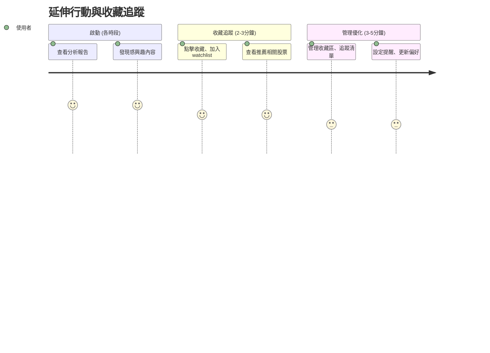

# 旅程六：延伸行動與收藏追蹤 (全時段)

## 🎯 使用者動機
收藏重要報告、追蹤相關股票、管理投資組合，建立個人化的投資管理系統。

## 👥 目標用戶特徵
- **時間限制**：各時段穿插使用，每次 2-5 分鐘
- **心理狀態**：需要系統化管理投資資訊
- **決策需求**：建立投資組合、追蹤相關標的

## 👣 用戶行為路徑



## 📊 核心功能需求

### 1. 收藏管理系統
- **報告收藏**：收藏重要分析報告
- **股票追蹤**：加入 watchlist 追蹤
- **分類管理**：按主題、產業分類管理

### 2. 智能推薦系統
- **相似股票**：基於持股推薦相似股票
- **產業相關**：推薦同產業相關股票
- **題材相關**：推薦相同題材概念股

### 3. 個人化設定
- **提醒設定**：設定價格、異動提醒
- **偏好學習**：學習用戶偏好
- **組合管理**：管理個人投資組合

## 🎨 介面設計重點

### 收藏管理頁面設計
```
┌─────────────────────────────────────┐
│ 📚 我的收藏                         │
│ 收藏報告：12篇 | 追蹤股票：8檔       │
├─────────────────────────────────────┤
│ 📊 追蹤股票                         │
│ 2330 台積電 ⭐⭐⭐⭐⭐ 已收藏        │
│ 2317 鴻海 ⭐⭐⭐⭐ 需關注           │
│ 2454 聯發科 ⭐⭐⭐⭐⭐ 強烈推薦     │
├─────────────────────────────────────┤
│ 🔍 推薦相關                         │
│ • 半導體產業：聯電、世界先進        │
│ • AI概念股：緯創、廣達              │
│ • 相似特徵：台達電、研華            │
└─────────────────────────────────────┘
```

### 推薦系統設計
- **智能推薦**：基於 AI 的智能推薦
- **用戶反饋**：推薦結果用戶反饋
- **持續優化**：基於反饋持續優化

## 💡 用戶體驗優化

### 1. 便利性
- **一鍵收藏**：一鍵收藏重要內容
- **快速管理**：快速管理收藏內容
- **智能分類**：自動分類收藏內容

### 2. 個人化
- **學習偏好**：學習用戶收藏偏好
- **個性化推薦**：基於偏好的推薦
- **自訂分類**：用戶自訂分類方式

### 3. 實用性
- **相關性**：推薦內容的相關性
- **時效性**：推薦內容的時效性
- **價值性**：推薦內容的投資價值

## 🎯 時段應用策略

### 盤前應用
- **重點收藏**：收藏盤前重要分析
- **觀察清單**：更新觀察清單
- **策略收藏**：收藏投資策略

### 盤中應用
- **即時收藏**：收藏即時重要資訊
- **異動追蹤**：追蹤異動股票
- **機會收藏**：收藏交易機會

### 盤後應用
- **總結收藏**：收藏盤後總結
- **策略收藏**：收藏明日策略
- **學習收藏**：收藏學習內容

## 📈 推薦算法

### 相似性推薦
- **技術面相似**：技術特徵相似股票
- **基本面相似**：財務特徵相似股票
- **產業相關**：同產業相關股票

### 協同過濾
- **用戶行為**：基於用戶行為推薦
- **群體智慧**：基於群體偏好推薦
- **內容過濾**：基於內容特徵推薦

### 深度學習
- **模式識別**：識別投資模式
- **趨勢預測**：預測投資趨勢
- **風險評估**：評估投資風險

## 🔍 管理功能深度

### 收藏管理
- **分類管理**：按主題、產業、時間分類
- **標籤系統**：自訂標籤管理
- **搜尋功能**：快速搜尋收藏內容

### 追蹤管理
- **價格提醒**：設定價格提醒
- **異動提醒**：設定異動提醒
- **新聞提醒**：設定新聞提醒

### 組合管理
- **組合追蹤**：追蹤投資組合表現
- **風險分析**：組合風險分析
- **調整建議**：組合調整建議

## 📊 品質指標

### 推薦準確性
- **相關性**：推薦內容相關性 > 80%
- **實用性**：推薦內容實用性 > 75%
- **用戶滿意度**：推薦滿意度 > 4.0/5

### 管理效率
- **使用頻率**：收藏功能使用率 > 60%
- **管理效率**：管理操作效率提升
- **用戶留存**：收藏功能留存率

## 🎯 成功指標

### 用戶行為指標
- **收藏頻率**：收藏使用率 > 60%
- **追蹤數量**：平均追蹤股票數 > 5檔
- **互動率**：推薦點擊率 > 40%

### 業務指標
- **用戶滿意度**：收藏功能滿意度 > 4.0/5
- **使用黏性**：收藏功能使用黏性
- **推薦效果**：推薦系統效果評估 