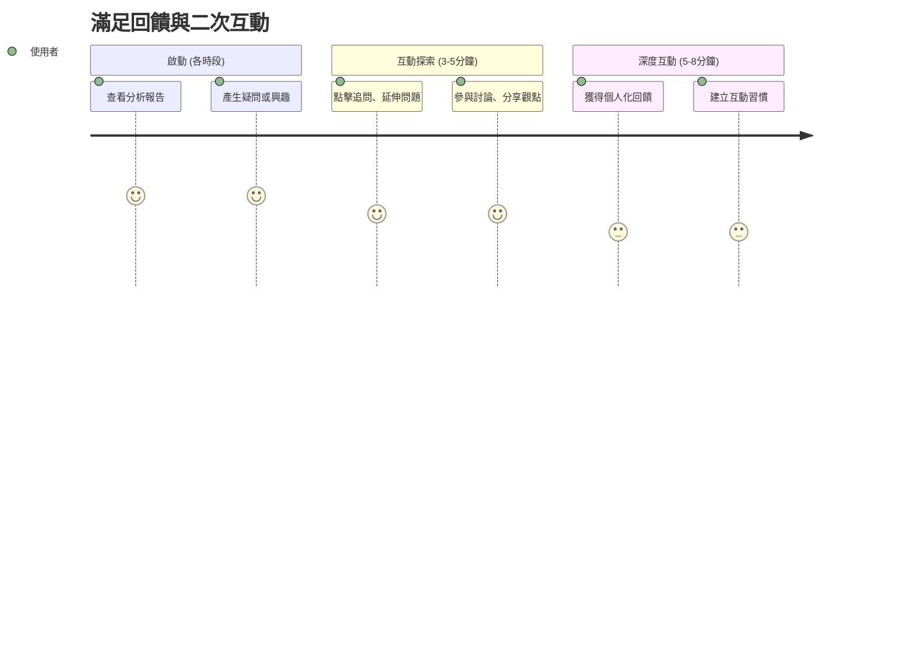

# 旅程七：滿足回饋與二次互動 (全時段)

## 🎯 使用者動機
追問細節、分享觀點、參與討論，獲得更深層的互動體驗與個人化回饋。

## 👥 目標用戶特徵
- **時間限制**：各時段穿插使用，每次 3-8 分鐘
- **心理狀態**：需要深度互動，驗證理解
- **決策需求**：澄清疑問、獲得更多資訊

## 👣 用戶行為路徑



## 📊 核心功能需求

### 1. 智能追問系統
- **自然語言**：自然語言提問
- **上下文理解**：理解對話上下文
- **深度回答**：提供深度專業回答

### 2. 社群互動功能
- **觀點分享**：分享個人投資觀點
- **討論參與**：參與投資討論
- **經驗交流**：與其他投資人交流

### 3. 個人化回饋
- **學習建議**：基於互動的學習建議
- **策略調整**：個人化策略調整建議
- **成長追蹤**：投資知識成長追蹤

##  介面設計重點

### 互動頁面設計
```
┌─────────────────────────────────────┐
│ 💬 與 AI 對話                        │
│ 您：為什麼台積電今天漲這麼多？      │
│ AI：基於以下因素分析...             │
├─────────────────────────────────────┤
│ 🤔 延伸問題                         │
│ • 法人動向如何？                    │
│ • 技術面支撐在哪？                  │
│ • 明日走勢預期？                    │
├─────────────────────────────────────┤
│ 👥 社群討論                         │
│ 12人正在討論台積電                  │
│ 熱門話題：AI概念股熱潮              │
└─────────────────────────────────────┘
```

### 互動功能設計
- **快速提問**：預設常見問題快速提問
- **深度對話**：展開深度對話模式
- **社群整合**：整合社群討論功能

## 💡 用戶體驗優化

### 1. 智能性
- **理解能力**：深度理解用戶問題
- **上下文記憶**：記住對話上下文
- **學習能力**：從互動中學習用戶偏好

### 2. 便利性
- **快速回應**：快速回應用戶問題
- **多種互動**：文字、語音、圖片互動
- **無縫切換**：不同互動模式無縫切換

### 3. 個人化
- **個性化回答**：根據用戶風格回答
- **學習路徑**：個人化學習路徑
- **成長追蹤**：追蹤用戶成長軌跡

## 🎯 時段應用策略

### 盤前應用
- **策略諮詢**：諮詢開盤策略
- **風險評估**：評估今日風險
- **準備建議**：盤前準備建議

### 盤中應用
- **即時諮詢**：即時市場諮詢
- **異動解釋**：解釋股價異動
- **交易建議**：即時交易建議

### 盤後應用
- **總結分析**：盤後總結分析
- **策略檢討**：策略檢討建議
- **學習指導**：投資知識學習

## 🤖 AI 互動能力

### 自然語言處理
- **語義理解**：深度語義理解
- **意圖識別**：準確識別用戶意圖
- **情感分析**：分析用戶情感狀態

### 專業知識庫
- **投資知識**：豐富的投資知識庫
- **市場數據**：即時市場數據
- **分析工具**：專業分析工具

### 學習能力
- **用戶建模**：建立用戶行為模型
- **偏好學習**：學習用戶偏好
- **持續優化**：持續優化回答品質

## 👥 社群互動功能

### 討論功能
- **主題討論**：按主題組織討論
- **即時互動**：即時互動功能
- **品質管理**：討論品質管理

### 分享功能
- **觀點分享**：分享投資觀點
- **經驗分享**：分享投資經驗
- **策略分享**：分享投資策略

### 學習功能
- **知識分享**：投資知識分享
- **案例學習**：成功案例學習
- **錯誤反思**：投資錯誤反思

## 📊 互動品質管理

### 回答品質
- **準確性**：回答準確性 > 90%
- **完整性**：回答完整性 > 85%
- **實用性**：回答實用性 > 80%

### 用戶滿意度
- **互動體驗**：互動體驗滿意度 > 4.2/5
- **回答滿意度**：回答滿意度 > 4.0/5
- **學習效果**：學習效果滿意度 > 4.1/5

### 持續改進
- **用戶反饋**：收集用戶反饋
- **模型優化**：持續優化 AI 模型
- **功能迭代**：功能持續迭代

## 🎯 成功指標

### 用戶行為指標
- **互動頻率**：互動使用率 > 50%
- **對話深度**：平均對話輪數 > 3輪
- **回訪率**：互動後回訪率 > 70%

### 業務指標
- **用戶滿意度**：互動功能滿意度 > 4.2/5
- **學習效果**：用戶學習效果評估
- **留存率**：互動功能留存率 