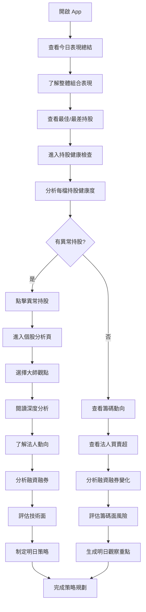
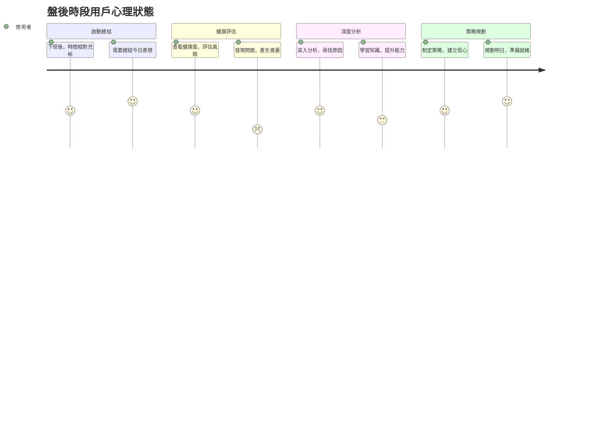

# 旅程三：盤後深度分析 (16:00-18:00)

## 🎯 使用者動機
上班族在盤後時間深入分析今日表現，了解籌碼動向，規劃明日投資策略。

## 👥 目標用戶特徵
- **時間限制**：下班後 1-2 小時，實際可用 15-30 分鐘
- **心理狀態**：需要總結今日表現，規劃明日策略
- **決策需求**：調整持股配置、設定明日觀察重點

## 👣 用戶行為路徑

```mermaid
journey
    title 盤後深度分析
    section 啟動 (16:00-16:05)
      開啟 App: 5: 使用者
      查看今日表現總結: 5: 使用者
    section 持股健康檢查 (16:05-16:15)
      查看持股健康狀況: 4: 使用者
      分析法人動向: 4: 使用者
    section 籌碼分析 (16:15-16:25)
      查看融資融券變化: 4: 使用者
      分析股權結構變化: 3: 使用者
    section 策略規劃 (16:25-16:30)
      閱讀個股深度報告: 3: 使用者
      規劃明日投資策略: 3: 使用者
```

## 🔄 詳細用戶流程



## 🕐 時段分析



## 📊 盤後資訊需求分析

### 1. 今日表現總結
**用戶需求**：全面了解今日投資表現
- **持股表現**：今日漲跌幅、成交量、報酬率
- **組合分析**：整體組合表現、產業分布變化
- **市場對比**：與大盤、同業表現對比

### 2. 持股健康狀況
**用戶需求**：深入評估持股健康度
- **健康度評分**：每檔持股的健康度評分
- **風險評估**：持股風險等級評估
- **異常提醒**：需要特別關注的持股

### 3. 籌碼面深度分析
**用戶需求**：了解資金流向和籌碼變化
- **法人動向**：外資、投信、自營商買賣超
- **融資融券**：融資融券餘額變化、融資使用率
- **股權結構**：大股東持股變化、董監持股

### 4. 技術面與基本面
**用戶需求**：多維度分析持股價值
- **技術指標**：K線形態、技術指標變化
- **基本面追蹤**：營收、獲利、產業趨勢
- **消息面整合**：重大消息、財報預期

## 🎨 介面設計重點

### 盤後首頁設計
```
┌─────────────────────────────────────┐
│ 📊 今日總結 (16:30)                 │
│ 💰 持股組合：+1.8% (大盤 +0.5%)     │
│ 📈 最佳表現：2454 聯發科 +3.2%      │
│ 📉 需關注：2317 鴻海 -1.5%          │
├─────────────────────────────────────┤
│ 🏥 持股健康狀況                     │
│ 2330 台積電：健康度 85分 ⭐⭐⭐⭐⭐  │
│ 2317 鴻海：健康度 65分 ⚠️ 需關注    │
│ 2454 聯發科：健康度 90分 ⭐⭐⭐⭐⭐  │
├─────────────────────────────────────┤
│ 🔍 籌碼動向分析                     │
│ 2330 台積電：外資買超 5,000張       │
│ 2317 鴻海：融資增加 2,000張         │
├─────────────────────────────────────┤
│ 📋 明日觀察重點                     │
│ • 2330 台積電法人動向               │
│ • 2317 鴻海融資變化                 │
│ • 半導體產業輪動                   │
└─────────────────────────────────────┘
```

### 深度報告設計
- **分層資訊**：摘要 → 詳細 → 專業分析
- **視覺化圖表**：籌碼動向圖、技術分析圖
- **對比分析**：歷史對比、同業對比

## 💡 用戶體驗優化

### 1. 深度分析
- **多維度視角**：技術面、籌碼面、基本面、情緒面
- **歷史對比**：與歷史同期表現對比
- **趨勢預判**：基於數據的趨勢分析

### 2. 策略規劃
- **明日重點**：自動生成明日觀察重點
- **風險提醒**：潛在風險與機會提示
- **操作建議**：基於分析的具體建議

### 3. 學習成長
- **知識點解說**：專業術語與概念解釋
- **案例學習**：成功/失敗案例分析
- **個人化建議**：基於用戶風格的建議

## 📈 數據分析深度

### 持股健康度分析
- **綜合評分**：技術面、基本面、籌碼面綜合評分
- **風險指標**：波動率、Beta值、夏普比率
- **趨勢分析**：健康度變化趨勢

### 籌碼面分析
- **法人動向追蹤**：外資、投信、自營商買賣超趨勢
- **融資融券分析**：融資融券餘額、使用率變化
- **股權結構變化**：大股東持股、董監持股變化

### 技術面分析
- **K線形態**：日K、週K、月K形態分析
- **技術指標**：MACD、KD、RSI等指標變化
- **支撐壓力**：重要支撐壓力位分析

### 基本面追蹤
- **營收獲利**：營收、EPS、ROE等財務指標
- **產業趨勢**：產業景氣、競爭態勢
- **消息面整合**：重大消息、財報預期

## 🎯 策略規劃工具

### 明日觀察重點
- **自動生成**：基於今日表現自動生成觀察重點
- **個人化設定**：用戶可自訂關注指標
- **提醒設定**：設定明日提醒條件

### 風險管理
- **風險評估**：持股風險等級評估
- **分散建議**：持股集中度改善建議
- **停損設定**：建議停損點位

### 機會發掘
- **相似股票**：基於持股特徵推薦相似股票
- **產業輪動**：產業輪動機會提示
- **題材發掘**：熱門題材與概念股

## 📊 報告品質指標

### 分析準確性
- **預測準確率**：技術分析預測準確率
- **建議有效性**：投資建議的實際效果
- **風險預警**：風險預警的及時性與準確性

### 用戶滿意度
- **報告深度**：分析深度滿意度 > 4.5/5
- **實用性**：實際投資決策幫助度 > 4.3/5
- **學習價值**：知識學習價值 > 4.0/5

## 🎯 成功指標

### 用戶行為指標
- **使用頻率**：盤後分析使用率 > 70%
- **停留時間**：平均使用時間 15-30 分鐘
- **互動深度**：點擊詳細分析 > 80%

### 業務指標
- **用戶滿意度**：盤後分析滿意度 > 4.4/5
- **決策影響**：基於分析的決策準確率
- **留存率**：盤後分析習慣養成率 