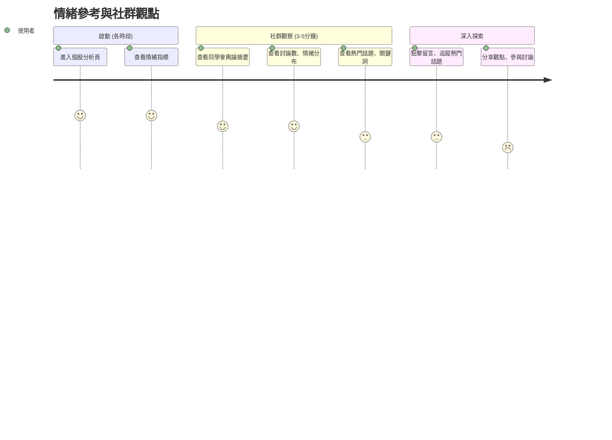

# 旅程四：情緒參考與社群觀點 (全時段)

## 🎯 使用者動機
想了解市場情緒、社群觀點，參考投資人對持股的看法，輔助投資決策。

## 👥 目標用戶特徵
- **時間限制**：穿插在各時段使用，每次 3-5 分鐘
- **心理狀態**：需要了解市場共識，避免情緒化決策
- **決策需求**：驗證個人判斷、發現潛在風險或機會

## 👣 用戶行為路徑



## 📊 核心功能需求

### 1. 情緒指標分析
- **整體情緒**：市場對該股的整體情緒評分
- **情緒變化**：情緒趨勢變化（樂觀/中性/悲觀）
- **情緒對比**：與同業、大盤情緒對比

### 2. 社群討論分析
- **討論熱度**：討論數、回覆數、關注度
- **主題提取**：熱門討論主題、關鍵詞雲
- **觀點分布**：看多/看空/中性觀點分布

### 3. 輿論風向追蹤
- **熱門話題**：即時熱門討論話題
- **爭議焦點**：有爭議的討論焦點
- **專家觀點**：知名投資人、分析師觀點

##  介面設計重點

### 情緒分析頁面設計
```
┌─────────────────────────────────────┐
│ 😊 市場情緒分析                     │
│ 整體情緒：樂觀 (75分)               │
│ 趨勢：上升 ↑ 討論熱度：高           │
├─────────────────────────────────────┤
│ 📊 情緒分布                         │
│ 看多 60% | 中性 25% | 看空 15%      │
├─────────────────────────────────────┤
│ 🔥 熱門話題                         │
│ • AI概念股熱潮持續                  │
│ • 法人買超動向                      │
│ • 技術面突破討論                    │
└─────────────────────────────────────┘
```

### 社群討論設計
- **分層顯示**：摘要 → 詳細討論 → 完整留言
- **情緒標記**：每條留言的情緒標記
- **互動功能**：點讚、回覆、分享

## 💡 用戶體驗優化

### 1. 時效性
- **即時更新**：情緒指標即時更新
- **趨勢追蹤**：情緒變化趨勢圖
- **熱門提醒**：重要討論即時提醒

### 2. 客觀性
- **數據驅動**：基於數據的情緒分析
- **多源整合**：整合多個社群平台
- **偏見過濾**：過濾極端情緒觀點

### 3. 實用性
- **決策輔助**：情緒分析與投資建議結合
- **風險提醒**：極端情緒的風險提醒
- **機會發掘**：情緒轉折的機會提示

## 🔍 情緒分析深度

### 技術分析
- **情緒指標**：恐懼貪婪指數、市場情緒指標
- **趨勢分析**：情緒週期、轉折點識別
- **對比分析**：與歷史情緒對比

### 社群分析
- **討論質量**：討論深度、專業度分析
- **影響力分析**：高影響力用戶觀點
- **傳播分析**：話題傳播路徑、速度

### 整合分析
- **多維度整合**：技術面+情緒面+基本面
- **預測模型**：基於情緒的價格預測
- **風險模型**：情緒極端的風險評估

## 🎯 時段應用策略

### 盤前應用
- **情緒預判**：預判今日市場情緒
- **話題追蹤**：追蹤隔夜重要話題
- **風險提醒**：極端情緒的風險提醒

### 盤中應用
- **即時情緒**：即時市場情緒變化
- **異動解釋**：股價異動的情緒解釋
- **機會發掘**：情緒轉折的交易機會

### 盤後應用
- **情緒總結**：今日情緒變化總結
- **明日預期**：基於情緒的明日預期
- **策略調整**：根據情緒調整策略

## 📊 品質指標

### 分析準確性
- **情緒準確率**：情緒分析準確率 > 80%
- **預測有效性**：基於情緒的預測有效性
- **風險預警**：情緒風險預警準確性

### 用戶滿意度
- **實用性**：情緒分析實用性 > 4.2/5
- **客觀性**：分析客觀性 > 4.0/5
- **時效性**：資訊時效性 > 4.3/5

## 🎯 成功指標

### 用戶行為指標
- **使用頻率**：情緒分析使用率 > 60%
- **停留時間**：平均使用時間 3-5 分鐘
- **互動率**：點擊詳細討論 > 50%

### 業務指標
- **用戶滿意度**：情緒分析滿意度 > 4.2/5
- **決策影響**：基於情緒的決策準確率
- **風險控制**：情緒風險預警效果 