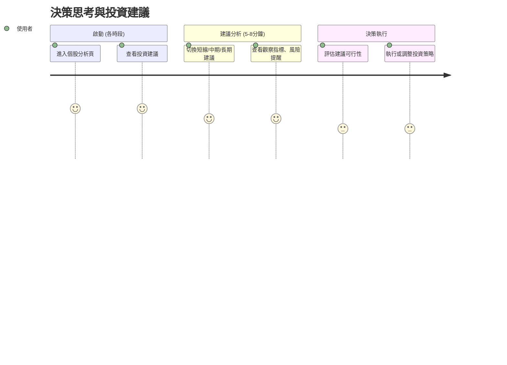

# 旅程五：決策思考與投資建議 (全時段)

## 🎯 使用者動機
基於多維度分析獲得客觀的投資建議，輔助投資決策，避免情緒化操作。

## 👥 目標用戶特徵
- **時間限制**：各時段穿插使用，每次 5-10 分鐘
- **心理狀態**：需要客觀建議，避免主觀偏見
- **決策需求**：買賣時機、持股策略、風險控制

## 👣 用戶行為路徑



## 📊 核心功能需求

### 1. 分時框架建議
- **短線建議**：1-5日操作建議
- **中期建議**：1-3個月投資策略
- **長期建議**：3-12個月投資規劃

### 2. 多維度分析整合
- **技術面**：技術指標、支撐壓力位
- **籌碼面**：法人動向、融資融券
- **基本面**：財務數據、產業趨勢
- **情緒面**：市場情緒、社群觀點

### 3. 風險管理建議
- **風險評估**：持股風險等級
- **停損建議**：建議停損點位
- **分散建議**：持股配置建議

##  介面設計重點

### 投資建議頁面設計
```
┌─────────────────────────────────────┐
│ 💡 AI 投資建議                      │
│ 綜合評分：⭐⭐⭐⭐ (4.2/5)          │
│ 建議：觀望 → 可考慮加碼             │
├─────────────────────────────────────┤
│ 📊 分時建議                         │
│ 短線(1-5日)：觀望，等待突破         │
│ 中期(1-3月)：偏多，目標價 580       │
│ 長期(3-12月)：看好，產業趨勢向上    │
├─────────────────────────────────────┤
│ ⚠ 風險提醒                         │
│ • 法人賣超需關注                    │
│ • 技術面面臨壓力位                  │
│ • 產業競爭加劇                      │
└─────────────────────────────────────┘
```

### 建議切換設計
- **標籤切換**：短線/中期/長期標籤
- **詳細展開**：點擊展開詳細分析
- **對比顯示**：不同時段建議對比

## 💡 用戶體驗優化

### 1. 客觀性
- **數據驅動**：基於客觀數據的建議
- **多源驗證**：多個分析維度交叉驗證
- **偏見過濾**：過濾主觀偏見

### 2. 實用性
- **具體建議**：提供具體的操作建議
- **時機把握**：明確的買賣時機建議
- **風險控制**：明確的風險控制措施

### 3. 個人化
- **風險偏好**：根據用戶風險偏好調整
- **投資風格**：適應不同投資風格
- **持股狀況**：基於用戶持股狀況建議

## 🎯 時段應用策略

### 盤前應用
- **開盤策略**：開盤操作建議
- **風險預警**：今日風險提醒
- **觀察重點**：今日觀察重點

### 盤中應用
- **即時建議**：基於即時數據的建議
- **交易時機**：最佳交易時機建議
- **風險控制**：即時風險控制建議

### 盤後應用
- **策略檢討**：今日策略檢討
- **明日規劃**：明日投資規劃
- **長期調整**：長期策略調整建議

## 📈 建議品質管理

### 建議準確性
- **預測準確率**：建議預測準確率追蹤
- **回測驗證**：歷史建議回測驗證
- **持續優化**：基於結果持續優化

### 風險控制
- **風險評估**：建議風險等級評估
- **極端情況**：極端市場情況處理
- **應急預案**：市場異常應急預案

### 透明度
- **邏輯說明**：建議邏輯清楚說明
- **數據來源**：數據來源透明化
- **更新機制**：建議更新機制說明

## 🔍 建議深度分析

### 技術分析建議
- **趨勢判斷**：技術趨勢判斷
- **支撐壓力**：重要支撐壓力位
- **突破信號**：技術突破信號

### 籌碼分析建議
- **法人動向**：法人買賣超建議
- **融資融券**：融資融券變化建議
- **籌碼集中度**：籌碼集中度分析

### 基本面建議
- **財務健康**：財務健康度評估
- **產業前景**：產業前景分析
- **估值水平**：估值合理性評估

## 📊 品質指標

### 建議有效性
- **準確率**：建議準確率 > 65%
- **風險控制**：風險控制效果
- **用戶滿意度**：建議滿意度 > 4.0/5

### 決策影響
- **決策採用率**：建議採用率 > 40%
- **投資效果**：基於建議的投資效果
- **風險降低**：風險降低效果

## 🎯 成功指標

### 用戶行為指標
- **使用頻率**：建議查看率 > 70%
- **停留時間**：平均使用時間 5-10 分鐘
- **互動率**：建議互動率 > 50%

### 業務指標
- **用戶滿意度**：投資建議滿意度 > 4.0/5
- **決策準確性**：基於建議的決策準確率
- **風險控制**：風險控制效果評估 