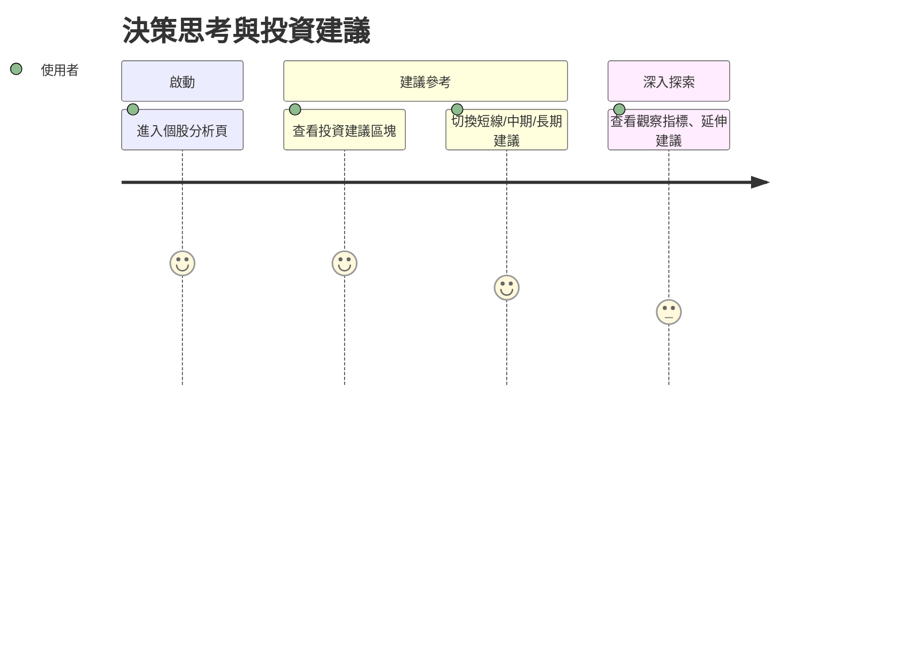

# 旅程五：決策思考與投資建議

## 🎯 使用者動機
想知道該不該買、該不該抱著、有哪些變數需觀察，獲得分時框架下的投資建議。

## 👣 用戶行為路徑

## 參考目標

### 任務主張
- 提供中立、分時框架下的投資建議，協助用戶決策。

### ✅ 使用者旅程思考
- 設計分時建議、觀察指標等資訊呈現。

### ✅ 功能/介面建議與想像（舉例）
- 投資建議區塊可切換短線/中期/長期
- 顯示觀察指標、延伸建議
- 策略語氣保持中立 