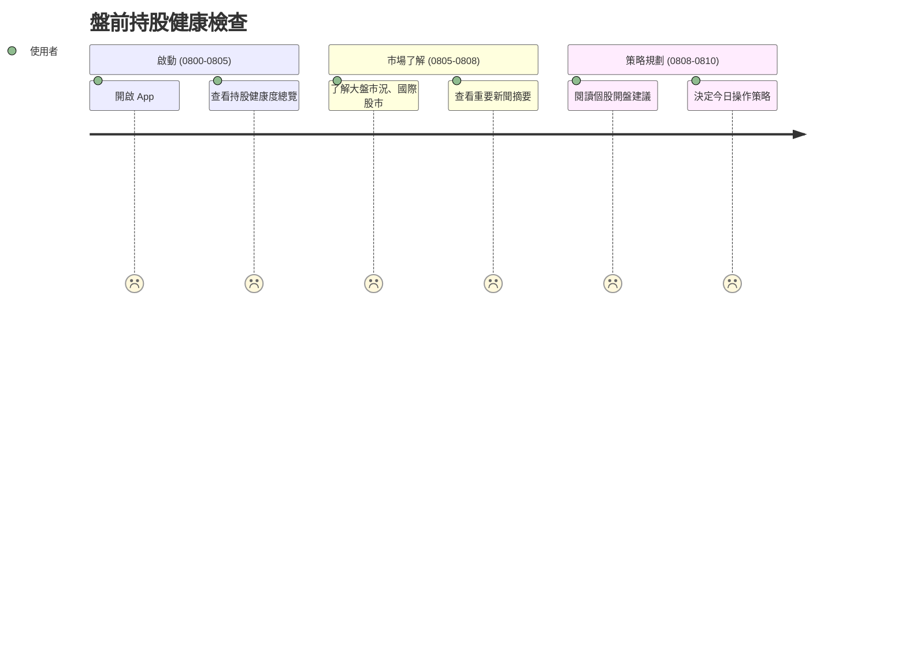
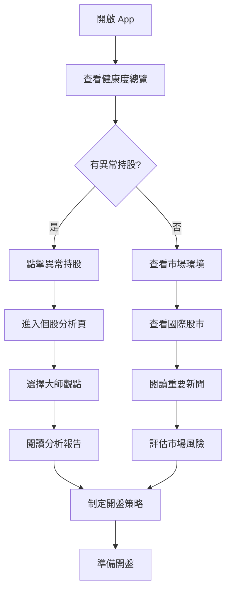
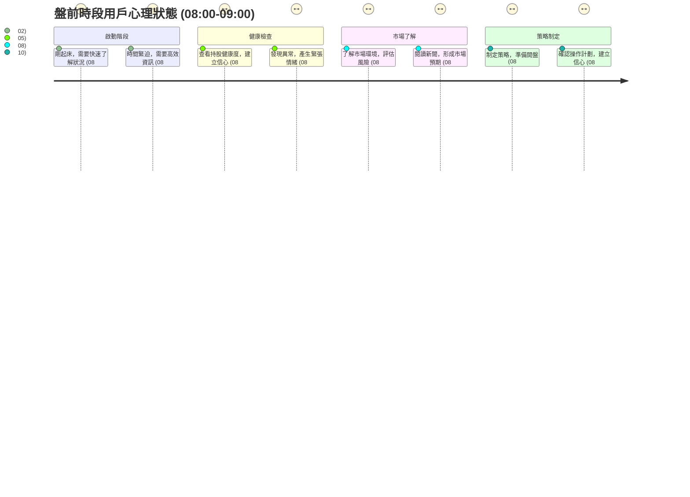

# 旅程一：每日追蹤持股健康狀況

## 🎯 使用者動機

上班族在開盤前快速了解持股健康狀況，預判今日風險與機會，決定開盤策略。

## 👥 目標用戶特徵

* **時間限制**：只有 5-10 分鐘準備時間
* **心理狀態**：需要快速建立今日投資信心
* **決策需求**：是否調整開盤策略、是否加減碼、盤前是否有重大資訊需要關注

## 👣 用戶行為路徑



## 🔄 詳細用戶流程



## 🕐 時段分析



## 📊 盤前資訊需求分析

### 1. 持股健康度總覽

**用戶需求**：快速了解手上持股是否異常

* **視覺化指標**：持股組合整體健康度評分
* **異常提醒**：需要特別關注的持股（漲跌幅異常、法人異動）
* **產業分布**：持股產業集中度風險提示

### 2. 市場環境了解

**用戶需求**：了解今日市場預期和外部影響

* **大盤市況**：台股大盤走勢預期、技術面分析
* **國際股市**：美股、日股、港股等國際股市表現
* **重要新聞**：隔夜重要財經新聞、政策消息

### 3. 個股開盤建議

**用戶需求**：獲得具體的操作建議

* **技術面**：開盤價位預期、支撐壓力位
* **籌碼面**：法人動向、融資融券變化
* **操作建議**：短線操作建議（觀望/加碼/減碼）

## 🎨 介面設計重點

### 首頁設計

```
┌─────────────────────────────────────┐
│ 🏠 早安！今日持股健康度：85分        │
│ ⚠️  2檔持股需要關注                 │
├─────────────────────────────────────┤
│ 📈 市場環境                         │
│ 台股：預期開盤 +0.3%                │
│ 美股：道瓊 +0.8% 那斯達克 +1.2%     │
│ 重要新聞：Fed官員談話、AI概念股熱潮  │
├─────────────────────────────────────┤
│ 📊 持股摘要                         │
│ 2330 台積電 +2.1% ⭐⭐⭐⭐⭐        │
│ 2317 鴻海 -1.2%  ⚠️ 需關注         │
│ 2454 聯發科 +0.8% ⭐⭐⭐⭐          │
└─────────────────────────────────────┘
```

### 異常提醒設計

* **顏色編碼**：綠色（正常）、黃色（注意）、紅色（異常）
* **快速入口**：點擊異常持股直接進入詳細分析
* **時間標記**：顯示異常發生時間，幫助判斷緊急程度

## 💡 用戶體驗優化

### 1. 時間效率

* **一頁式設計**：所有關鍵資訊在首頁呈現
* **快速掃描**：5秒內掌握整體狀況
* **深度入口**：點擊進入詳細分析

### 2. 決策支援

* **明確建議**：提供具體的操作建議
* **風險提示**：清楚標示風險等級
* **信心建立**：正面資訊優先呈現

### 3. 個人化

* **持股優先**：用戶持股優先顯示
* **習慣學習**：記住用戶常關注的指標
* **提醒設定**：可設定個人化的異常標準

## 🎯 成功指標

### 用戶行為指標

* **開啟率**：盤前時段 App 開啟率 > 80%
* **停留時間**：平均使用時間 5-10 分鐘
* **互動率**：點擊異常提醒進入詳細分析 > 60%

### 業務指標

* **用戶滿意度**：盤前準備滿意度 > 4.5/5
* **決策信心**：用戶對開盤策略的信心度提升
* **留存率**：盤前使用習慣的養成率
